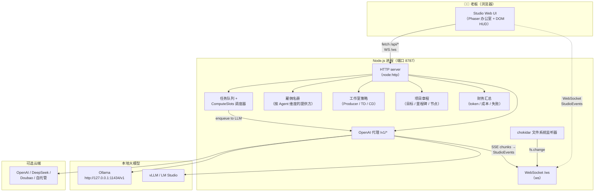
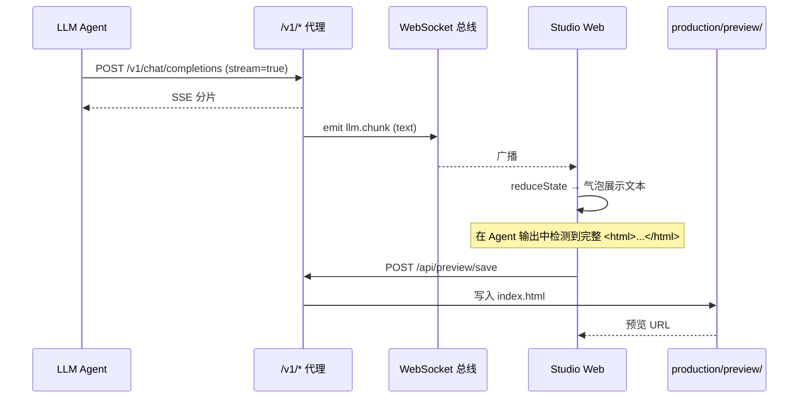
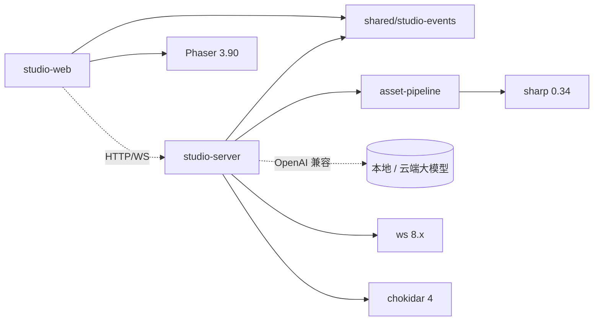

# 架构

AiGameAgent Studio 是一个**包含三个工作区的 monorepo**，外加一层 OpenSpec 变更控制，目标是在单个 Node.js 进程内运行一座小型虚拟游戏工作室。

## 全局架构图



## 分层拆解

| 层 | 代码 | 职责 |
|------|------|----------------|
| **表现层** | `apps/studio-web/src/main.ts`（约 4,250 LOC） | Phaser 等距办公室、DOM HUD / 抽屉、WebSocket 客户端、面板逻辑 |
| **服务端核心** | `apps/studio-server/src/index.ts`（约 3,630 LOC） | HTTP 路由、队列、雇佣、策略、章程、财务、代理、WebSocket 广播 |
| **资源管线** | `apps/studio-server/src/asset-pipeline.ts`（约 280 LOC） | 图像生成、雪碧图打包、视频转码（sharp + ffmpeg） |
| **共享类型** | `packages/shared/src/studio-events.ts`（约 240 LOC） | 25 种 StudioEvent 类型、StudioAgentState、reduceState reducer |
| **变更控制** | `openspec/` | 9 份能力规范 + 1 份已归档的变更提案 |
| **Agent 清单** | `.claude/agents/*.md`（30 份文件） | frontmatter + 正文，声明每个 Agent 的角色、工具、范围 |
| **Skill 库** | `.claude/skills/*/SKILL.md`（44 个 skill） | 可复用的流程（setup-engine、brainstorm、gate-check 等） |
| **规则** | `.claude/rules/*.md`（7 条规则） | 路径作用域内的风格 / 架构规则（engine-code、design-docs 等） |
| **钩子** | `.claude/hooks/*.sh`（6 个钩子） | SessionStart / PreCompact / session-stop / pre-commit / pre-push 门禁 |

## 请求流示例：老板开启一次会议

1. **UI** 打开会议抽屉 → 以 `{ projectId, topic }` 调用 `POST /api/meeting/start`
2. **服务端** 构造项目专属的会议任务 → 以 `source=meeting_kickoff` 入队给 Producer / TD / CD
3. **调度器** 在 `ComputeSlots`（默认 1，可配置）中执行该任务 → 通过 `/v1/chat/completions` 调用大模型
4. **代理** 流式回传 SSE → 为每个 delta 发出 `llm.chunk` 事件
5. **WebSocket** 将事件扇出给所有 UI 客户端
6. **UI** 归并状态 → 重绘办公室 → secretary HUD 进行总结
7. **UI** 自动将完整 HTML 输出保存到 `production/preview/<projectId>/index.html`

## 请求流示例：Agent 写出 HTML 预览



## 模块依赖图



## 核心抽象

- **StudioEventEnvelope** —— `{ v, ts, type, sessionId, correlationId, agentId?, payload }` 是所有事件共用的单一类型，其上派生 25 种带类型的变体。
- **Job** —— `{ id, agentId, task, priority, createdAt, providerId, projectId, workgroupId, status, source?, producerChainId? }`
- **StudioPolicy** —— 三层：`producer`、`technicalDirector`、`creativeDirector`；每层可以是 `rules` 或 `llm` 模式。
- **Hire roster** —— `Set<agentId>`；首次运行时默认载入全部 30 个 Agent。
- **Charter** —— 每个项目 `{ goal, milestones[], nodes[] }`，带有 `version + archivedAt` 快照。
- **Provider** —— `{ id, label, kind: local|lan|cloud, baseUrl, model, capabilities, pricing }`。

## 工作区布局（带注释）

```
AiGameAgent/
├── apps/
│   ├── studio-server/        # Node.js HTTP + WS，端口 8787
│   │   ├── src/index.ts      # 主服务端（3,630 LOC）
│   │   ├── src/asset-pipeline.ts
│   │   └── tsconfig.json
│   └── studio-web/           # Phaser + Vite，dev 端口 5173
│       ├── src/main.ts       # 4,250 LOC：办公室 + DOM HUD
│       ├── src/style.css
│       ├── index.html
│       └── vite.config.ts
├── packages/
│   └── shared/
│       └── src/studio-events.ts  # 25 种事件类型 + reducer
├── .claude/
│   ├── agents/               # 30 份角色清单
│   ├── skills/               # 44 份 SKILL.md 流程
│   ├── rules/                # 7 条路径作用域规则
│   ├── hooks/                # 6 个生命周期脚本
│   └── docs/                 # 9 份协作 / 搭建文档
├── openspec/
│   ├── config.yaml
│   ├── specs/                # 9 份能力规范
│   └── changes/              # 1 份已归档变更
├── docs/                     # 协作 + 端到端清单
├── production/               # 运行时状态（已 gitignore）
├── scripts/                  # studio-e2e-smoke.mjs
├── package.json              # npm workspaces
└── tsconfig.base.json
```

## 接下来

- 查看 [技术栈](/tech-stack) 了解具体版本与各模块职责。
- 想读服务端代码？从 [Studio Server](/docs/01-studio-server) 开始。
- 想读客户端代码？从 [Studio Web](/docs/02-studio-web) 开始。
