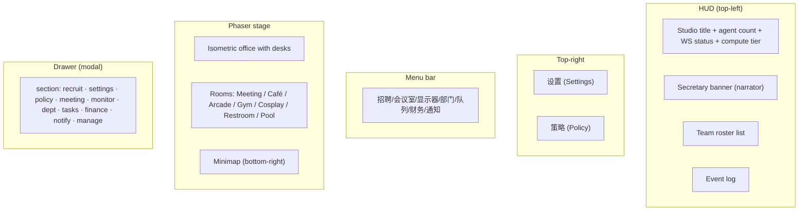
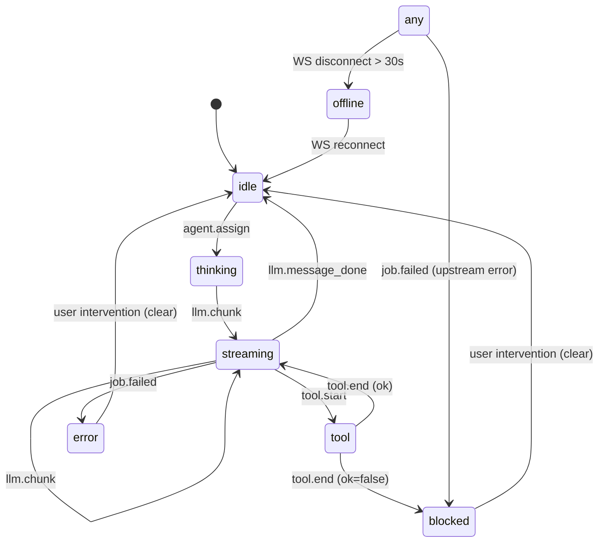

# 02 · Studio Web (Isometric Office)

The Studio Web is a **Phaser 3.90 isometric office** plus a stack of DOM panels (HUD, drawer, menus). It's the "stage" where the boss watches agents work, opens drawers, clicks desks, and saves previews.

**Source:** `apps/studio-web/src/main.ts` (~4,250 LOC) · `src/style.css` · `index.html` · `vite.config.ts`

## What you see on first load



## Isometric projection (Kairo-like)

```ts
const ISO = { tileW: 64, tileH: 32, originX: 140, originY: 140 };

function isoToScreen(gx: number, gy: number) {
  const x = (gx - gy) * (ISO.tileW / 2) + ISO.originX;
  const y = (gx + gy) * (ISO.tileH / 2) + ISO.originY;
  return { x, y };
}
```

The "office" is a 2D grid `(gx, gy)` rendered to a flat top-down diamond. Each desk sits on a `(gx, gy)` cell; the office is wide and tall enough for ~30 desks in distinct department clusters.

The grid is panned by **dragging on empty space** and zoomed with the **mouse wheel** (clamped 0.6× – 2.0×). The minimap is a second camera at 0.18× zoom that shows the same scene; clicking the minimap jumps the main camera.

## The `OfficeScene` class

This is the Phaser `Scene` that owns desks, agents, room decorations, and the idle/move tweens. Its state is:

```ts
type Desk = {
  agentId: string;
  x: number; y: number;
  gx: number; gy: number;
  status: string;
  label: Phaser.GameObjects.Text;
  statusIcon: Phaser.GameObjects.Image;
  statusText: Phaser.GameObjects.Text;
  avatar: Phaser.GameObjects.Image;
  desk: Phaser.GameObjects.Image;
  hit?: Phaser.GameObjects.Rectangle;
  baseX: number; baseY: number;
  homeGx: number; homeGy: number;
  breakReturnAfterAt?: number;
  lastBreakTripAt?: number;
  lastWanderAt?: number;
  moving?: boolean;
  bubble?: Phaser.GameObjects.Text;
  lastBubbleAt?: number;
  idleBobTween?: Phaser.Tweens.Tween;
  bobPhaseMs?: number;
  navHint?: Phaser.GameObjects.Text;
  navPathGfx?: Phaser.GameObjects.Graphics;
  inBanter?: boolean;
  pendingGx?: number;
  pendingGy?: number;
};
```

A `Desk` is one agent's "home cell" plus all the visual gizmos that decorate it: a label, a status icon, an avatar sprite, a desk sprite, an optional hit rect, and a transient "speech bubble" that shows the latest streaming text.

## Departments and visual layout

Departments cluster desks in named regions:

| Department | Where | Agents |
|-----------|-------|--------|
| `leadership` | Top row, central | `producer`, `technical-director`, `creative-director` |
| `design` | Near leadership | `game-designer`, `systems-designer`, `level-designer`, `economy-designer`, `narrative-director`, `writer` |
| `programming` | Mid-left | `lead-programmer`, `gameplay-programmer`, `engine-programmer`, `ai-programmer`, `network-programmer`, `tools-programmer`, `ui-programmer` |
| `art_audio` | Mid-right | `art-director`, `audio-director`, `sound-designer`, `technical-artist` |
| `narrative` | Bottom-left | `narrative-director`, `writer`, `localization-lead`, `community-manager` |
| `qa_release` | Bottom-right | `qa-lead`, `qa-tester`, `release-manager`, `devops-engineer`, `security-engineer`, `performance-analyst` |
| `other` | Scattered | `prototyper`, `accessibility-specialist`, `analytics-engineer`, `live-ops-designer`, `world-builder`, `ux-designer` |

Rooms (Meeting, Café, Arcade, Gym, Cosplay, Restroom, Pool) sit at the bottom of the map and have door markers so agents can walk in.

## Agent status state machine



A secretary HUD loop runs every ~10 seconds and looks for: an agent in `error`, an agent stuck in `streaming`/`thinking`/`tool`/`blocked` for 2-60 minutes, a backlog (queue ≥ 5 with 0 running), or a project with no preview. Each condition is throttled to once per 70-130s per kind to avoid spam.

## The "secretary"

The secretary is a chatty narrator implemented entirely in `main.ts` (~400 LOC of HUD code). It:

- Detects idle (>2 min in `thinking`/`tool`/`blocked`/`streaming`) and reminds the boss
- Detects backlog (queue ≥ 5, 0 running) and suggests checking `ComputeSlots`
- Detects missing preview and tells the boss the URL
- Detects upstream errors and surfaces the upstream message
- Detects when an agent finishes streaming a complete HTML document and triggers auto-save

It's deliberately repetitive — it pushes the same line at most once every `minGapMs` per agent, so a long-running LLM doesn't flood the log.

## "Department" drawer

The department drawer shows per-department KPIs:

- **Output** — `file changes` + `LLM chunks` over the last event window
- **Bugs** — `tool.end.ok=false` + `job.finished.ok=false`
- **Block** — count of agents in `blocked` / `error` state
- A short tailored summary per department ("QA watch: focus on failed jobs and tool errors")

Three actions are wired:

- **通过 (Approve)** → enqueue a "summary + next steps" task to the producer for that project
- **驳回 (Reject)** → enqueue a "list issues and re-do" task
- **继续/重做 (Redo)** → enqueue a "confirm goals and re-execute" task

Each one is a real `POST /api/dept/workorder/action` — the policy decides the agent's provider.

## "Meeting" drawer — the kickoff flow

1. Boss types a `topic` (or "（待补充主题）")
2. Toggles `Skip LLM` for a rule-based meeting
3. Clicks **开始会议 (Start meeting)**
4. UI shows a streaming transcript: each line is `Speaker: text`
5. Three speakers take turns: 制作人, 技术总监, 创意总监
6. Boss sees a **charter form** (goal, milestones, nodes) they can edit
7. **归档 (Archive)** freezes a version
8. **保存草稿 (Save draft)** persists without bumping version
9. When the draft diverges from the archive, the meeting shows `待确认偏离: ...`

The auto-kickoff checkbox (in the meeting tab) starts a producer/TD/CD round immediately after archiving the charter.

## "Monitor" drawer — preview & history

- An iframe (`#previewFrame`) loads `/preview?projectId=X&v=...`
- A textarea accepts HTML (with auto-extraction of `<!doctype html>...</html>` from prose)
- A history list shows past `index.html` snapshots; click to view, or "restore" to overwrite current
- The iframe auto-refreshes when `studio-preview-saved` event fires

The "auto-save" magic: when the reducer detects that an agent's `streamDraft` ends with `</html>`, it POSTs to `/api/preview/save` automatically. The secretary HUD narrates "秘书：检测到完整 HTML，已自动保存到显示器".

## DOM / Phaser interaction (the famous "click-through" bug)

The DOM HUD and drawer sit on top of the Phaser canvas. Two common bugs:

1. A DOM region without `pointer-events: auto` lets clicks "fall through" to the canvas, accidentally panning/zooming
2. A canvas pointer event triggered from a DOM interaction area causes the wrong action

The fix lives in `setupControls()` and `shouldIgnoreGameObjectTap()`:

```ts
private isClientOverDomUi(clientX: number, clientY: number): boolean {
  // geometric check: inside #hud / #topRightBar / #menuBar / #drawer / #drawerMask?
  if (inside(document.getElementById("hud"))) return true;
  // ... etc
  const el = document.elementFromPoint(clientX, clientY);
  if (!el || el === canvas) return false;
  return true;
}

private shouldIgnoreGameObjectTap(pointer: Phaser.Input.Pointer, maxDragPx = 12): boolean {
  if (this.pointerDragDistance(pointer) > maxDragPx) return true;
  const c = this.pointerClientXY(pointer);
  if (c && this.isClientOverDomUi(c.x, c.y)) return true;
  return false;
}
```

This is encoded as a **capability** (`studio-web-ui`) and an **archived change** (`studio-web-ui-click-through-fix`).

## WebSocket state reducer

The front-end maintains a local copy of `StudioState` and reduces every event into it:

```ts
private reduce(ev: StudioEventEnvelope) {
  const aid = ev.agentId;
  if (!aid) return;
  const before = this.state.agents[aid] ?? { agentId: aid, status: "idle" };
  const next: StudioAgentState = { ...before, lastTs: ev.ts };
  // type-specific update
  switch (ev.type) {
    case "llm.chunk": next.status = "streaming"; next.streamDraft += ev.payload.text; break;
    case "llm.message_done": next.status = "idle"; next.summary = next.streamDraft; next.streamDraft = ""; break;
    case "tool.start": next.status = "tool"; break;
    case "tool.end": next.status = "tool"; /* keep status, mark end */ break;
    case "agent.assign": next.status = "thinking"; next.jobId = ev.payload.jobId; break;
    case "job.failed": next.status = "error"; break;
  }
  this.state.agents[aid] = next;
}
```

The reducer is throttled to repaint at most every 80ms (configurable via `lastPaint`).

## Build & dev

```bash
cd apps/studio-web
npm run dev        # vite on 127.0.0.1:5173
npm run build      # vite build → dist/
npm run preview    # vite preview on 127.0.0.1:5173
```

The Vite config pins port (`strictPort: true`) — if 5173 is taken, it fails loud.

## Why Phaser (and not React)?

- Phaser is **rendering-first**: cheap sprites, free scroll/pan/zoom, free tween engine, free depth sorting. The office has 30+ sprites + tweens + a second camera (minimap) — all of that is what Phaser does in 10 lines.
- The DOM is **forms-first**: HUD, drawer, settings. React would add ~50KB and zero benefit for a forms-heavy panel.
- The split mirrors the [Kairosoft game pattern](https://en.wikipedia.org/wiki/Kairosoft): the office is a "tycoon view" of the game, and the boss interacts with it like a board.

## Next

- [Shared Events Bus](/docs/03-events-bus) — every event the front-end reduces
- [Agent Roster & Departments](/docs/04-agents-and-departments) — what each agent is good for
- [Meeting Room & Project Charter](/docs/06-meeting-and-charter) — the kickoff flow in detail
