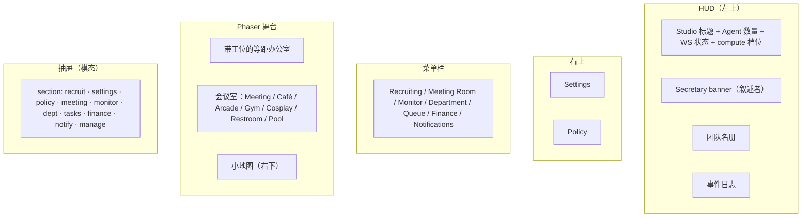
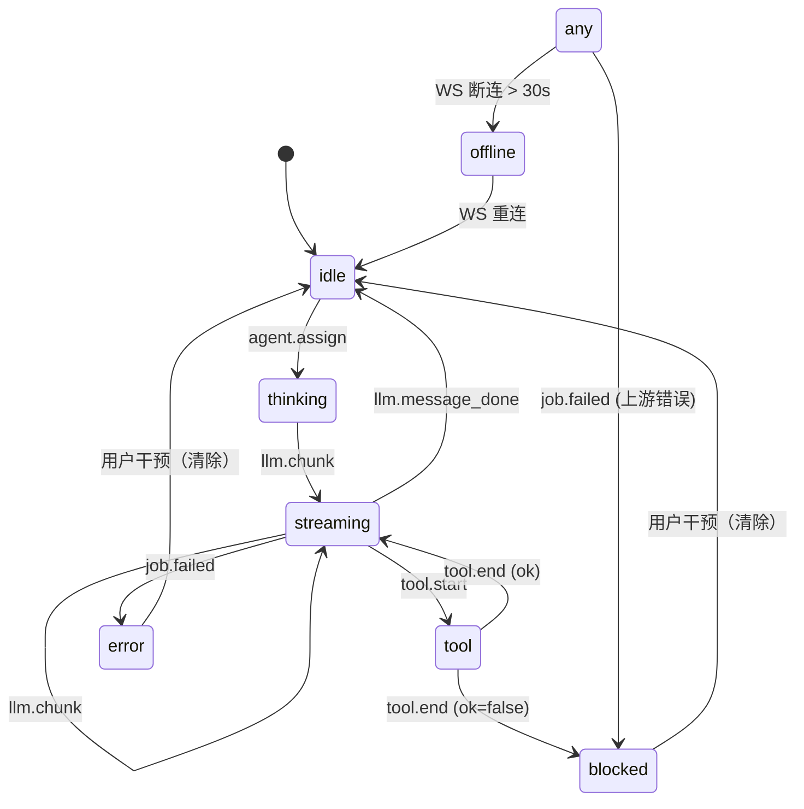

# 02 · Studio Web（等距办公室）

Studio Web 是一个 **Phaser 3.90 等距办公室**，外加一组 DOM 面板（HUD、抽屉、菜单）。它是老板盯 Agent 工作、打开抽屉、点击工位、保存预览的"舞台"。

**源码：** `apps/studio-web/src/main.ts`（约 4,250 LOC） · `src/style.css` · `index.html` · `vite.config.ts`

## 首次加载时的界面



## 等距投影（Kairo 风格）

```ts
const ISO = { tileW: 64, tileH: 32, originX: 140, originY: 140 };

function isoToScreen(gx: number, gy: number) {
  const x = (gx - gy) * (ISO.tileW / 2) + ISO.originX;
  const y = (gx + gy) * (ISO.tileH / 2) + ISO.originY;
  return { x, y };
}
```

"办公室" 是一个渲染为平顶菱形的 2D 网格 `(gx, gy)`。每个工位占据一个 `(gx, gy)` 格；办公室足够宽、足够高，能容纳按部门分布的约 30 个工位。

网格通过 **在空白区域拖拽** 平移，通过 **鼠标滚轮** 缩放（夹在 0.6× – 2.0×）。小地图是一台以 0.18× 缩放显示同一场景的第二相机；点击小地图会跳到主相机对应位置。

## `OfficeScene` 类

这是 Phaser 的 `Scene`，负责工位、Agent、会议室装饰以及 idle / move 补间动画。它的状态如下：

```ts
type Desk = {
  agentId: string;
  x: number; y: number;
  gx: number; gy: number;
  status: string;
  label: Phaser.GameObjects.Text;
  statusIcon: Phaser.GameObjects.Image;
  statusText: Phaser.GameObjects.Text;
  avatar: Phaser.GameObjects.Image;
  desk: Phaser.GameObjects.Image;
  hit?: Phaser.GameObjects.Rectangle;
  baseX: number; baseY: number;
  homeGx: number; homeGy: number;
  breakReturnAfterAt?: number;
  lastBreakTripAt?: number;
  lastWanderAt?: number;
  moving?: boolean;
  bubble?: Phaser.GameObjects.Text;
  lastBubbleAt?: number;
  idleBobTween?: Phaser.Tweens.Tween;
  bobPhaseMs?: number;
  navHint?: Phaser.GameObjects.Text;
  navPathGfx?: Phaser.GameObjects.Graphics;
  inBanter?: boolean;
  pendingGx?: number;
  pendingGy?: number;
};
```

`Desk` 是一个 Agent 的"家格子"，以及装饰它的所有可视化元素：标签、状态图标、头像精灵、工位精灵、可选的 hit 矩形，以及一个显示最新流式文本的临时"对话气泡"。

## 部门与可视化布局

部门按命名区域聚类工位：

| 部门 | 位置 | Agent |
|-----------|-------|--------|
| `leadership` | 顶部一行，居中 | `producer`、`technical-director`、`creative-director` |
| `design` | 紧邻 leadership | `game-designer`、`systems-designer`、`level-designer`、`economy-designer`、`narrative-director`、`writer` |
| `programming` | 中部偏左 | `lead-programmer`、`gameplay-programmer`、`engine-programmer`、`ai-programmer`、`network-programmer`、`tools-programmer`、`ui-programmer` |
| `art_audio` | 中部偏右 | `art-director`、`audio-director`、`sound-designer`、`technical-artist` |
| `narrative` | 左下 | `narrative-director`、`writer`、`localization-lead`、`community-manager` |
| `qa_release` | 右下 | `qa-lead`、`qa-tester`、`release-manager`、`devops-engineer`、`security-engineer`、`performance-analyst` |
| `other` | 散布 | `prototyper`、`accessibility-specialist`、`analytics-engineer`、`live-ops-designer`、`world-builder`、`ux-designer` |

会议室（Meeting、Café、Arcade、Gym、Cosplay、Restroom、Pool）位于地图底部，带有门标记，Agent 可以走进去。

## Agent 状态机



一个 secretary HUD 循环每约 10 秒运行一次，查找：处于 `error` 的 Agent、卡在 `streaming` / `thinking` / `tool` / `blocked` 长达 2-60 分钟的 Agent、积压（队列 ≥ 5 且 0 运行中）、没有预览的项目。每种情况每 70-130 秒最多触发一次，避免刷屏。

## "Secretary"

Secretary 是一个话痨叙述者，全部在 `main.ts` 中实现（约 400 LOC 的 HUD 代码）。它会：

- 检测空闲（在 `thinking` / `tool` / `blocked` / `streaming` 超过 2 分钟）并提醒老板
- 检测积压（队列 ≥ 5，0 运行中）并建议检查 `ComputeSlots`
- 检测缺少预览并告诉老板 URL
- 检测上游错误并展示上游消息
- 检测 Agent 完成一次完整 HTML 文档的流式输出并触发自动保存

它刻意重复——对同一 Agent 在每 `minGapMs` 毫秒内最多推同一句话一次，避免长跑的大模型刷爆日志。

## "Department" 抽屉

部门抽屉展示每部门的 KPI：

- **Output** —— 在最近事件窗口内的 `file changes` + `LLM chunks`
- **Bugs** —— `tool.end.ok=false` + `job.finished.ok=false`
- **Block** —— 处于 `blocked` / `error` 状态的 Agent 数
- 每部门一段量身定制的摘要（"QA watch: focus on failed jobs and tool errors"）

三个动作已接线：

- **Approve** → 给该项目的 Producer 入队一个 "summary + next steps" 任务
- **Reject** → 入队一个 "list issues and re-do" 任务
- **Redo** → 入队一个 "confirm goals and re-execute" 任务

每个动作都是真实的 `POST /api/dept/workorder/action` ——由策略决定 Agent 的提供方。

## "Meeting" 抽屉——Kickoff 流程

1. 老板输入 `topic`（或 "(topic to be added)"）
2. 勾选 `Skip LLM` 走基于规则的会议
3. 点击 **Start meeting**
4. UI 展示流式转写：每行形如 `Speaker: text`
5. 三位 Speaker 轮流发言：Producer、Technical Director、Creative Director
6. 老板看到一份**章程表单**（goal、milestones、nodes），可以编辑
7. **Archive** 冻结一个版本
8. **Save draft** 持久化但不动版本号
9. 当草稿与归档偏离时，会议视图展示 `Pending drift: ...`

会议标签页里的 auto-kickoff 复选框会在归档章程后立即启动 Producer / TD / CD 轮转。

## "Monitor" 抽屉——预览与历史

- 一个 iframe（`#previewFrame`）加载 `/preview?projectId=X&v=...`
- 一个 textarea 接受 HTML（自动从散文中抽取 `<!doctype html>...</html>`）
- 历史列表展示过去的 `index.html` 快照；点击查看，或 "restore" 覆盖当前
- iframe 在 `studio-preview-saved` 事件触发时自动刷新

"自动保存"的魔法：当 reducer 检测到某 Agent 的 `streamDraft` 以 `</html>` 结尾时，自动 POST 到 `/api/preview/save`。Secretary HUD 会旁白 "Secretary: complete HTML detected, auto-saved to the monitor"。

## DOM / Phaser 交互（著名的"点击穿透" bug）

DOM HUD 与抽屉盖在 Phaser canvas 之上。两个常见 bug：

1. 缺少 `pointer-events: auto` 的 DOM 区域会让点击"穿透"到 canvas，意外触发平移 / 缩放
2. 从 DOM 交互区域触发的 canvas 指针事件会导致错误的动作

修复落在 `setupControls()` 与 `shouldIgnoreGameObjectTap()`：

```ts
private isClientOverDomUi(clientX: number, clientY: number): boolean {
  // 几何检测：是否位于 #hud / #topRightBar / #menuBar / #drawer / #drawerMask 内？
  if (inside(document.getElementById("hud"))) return true;
  // ... 等等
  const el = document.elementFromPoint(clientX, clientY);
  if (!el || el === canvas) return false;
  return true;
}

private shouldIgnoreGameObjectTap(pointer: Phaser.Input.Pointer, maxDragPx = 12): boolean {
  if (this.pointerDragDistance(pointer) > maxDragPx) return true;
  const c = this.pointerClientXY(pointer);
  if (c && this.isClientOverDomUi(c.x, c.y)) return true;
  return false;
}
```

这被编码成一份**能力**（`studio-web-ui`）以及一份**已归档的变更**（`studio-web-ui-click-through-fix`）。

## WebSocket 状态 reducer

前端维护一份 `StudioState` 的本地副本，把每个事件都规约进去：

```ts
private reduce(ev: StudioEventEnvelope) {
  const aid = ev.agentId;
  if (!aid) return;
  const before = this.state.agents[aid] ?? { agentId: aid, status: "idle" };
  const next: StudioAgentState = { ...before, lastTs: ev.ts };
  // 按类型更新
  switch (ev.type) {
    case "llm.chunk": next.status = "streaming"; next.streamDraft += ev.payload.text; break;
    case "llm.message_done": next.status = "idle"; next.summary = next.streamDraft; next.streamDraft = ""; break;
    case "tool.start": next.status = "tool"; break;
    case "tool.end": next.status = "tool"; /* 保持状态，标记结束 */ break;
    case "agent.assign": next.status = "thinking"; next.jobId = ev.payload.jobId; break;
    case "job.failed": next.status = "error"; break;
  }
  this.state.agents[aid] = next;
}
```

reducer 被节流为最多每 80ms 重绘一次（可通过 `lastPaint` 配置）。

## 构建与开发

```bash
cd apps/studio-web
npm run dev        # vite on 127.0.0.1:5173
npm run build      # vite build → dist/
npm run preview    # vite preview on 127.0.0.1:5173
```

Vite 配置固定端口（`strictPort: true`）——如果 5173 被占用，会大声报错。

## 为什么用 Phaser（而不是 React）？

- Phaser **渲染优先**：便宜的精灵、自带滚动 / 平移 / 缩放、自带补间引擎、自带深度排序。办公室有 30+ 个精灵 + 补间 + 一台第二相机（小地图）——这一切 Phaser 用 10 行就能搞定。
- DOM **表单优先**：HUD、抽屉、Settings。React 会带来约 50KB，对一个表单密集的面板没有任何收益。
- 这种拆分复刻了 [Kairosoft 游戏的模式](https://en.wikipedia.org/wiki/Kairosoft)：办公室是游戏的"tycoon 视图"，老板像操作棋盘一样与之交互。

## 接下来

- [共享事件总线](/docs/03-events-bus)——前端归约的每一个事件
- [Agent 名册与部门](/docs/04-agents-and-departments)——每个 Agent 的专长
- [会议室与项目章程](/docs/06-meeting-and-charter)——kickoff 流程的细节
