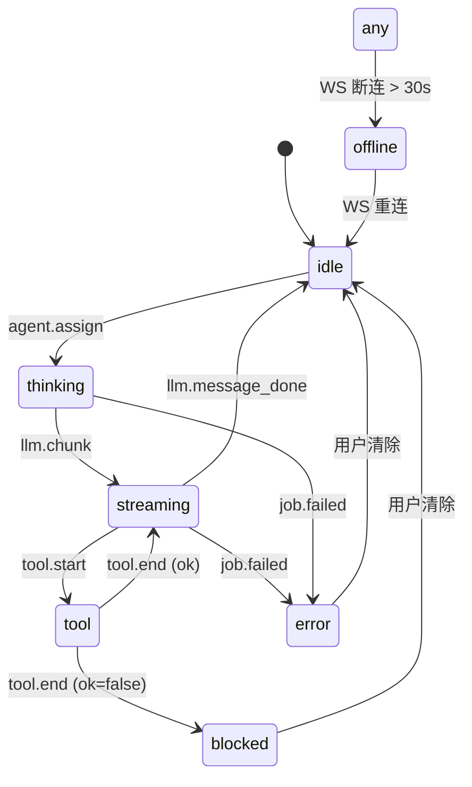

# 03 · 共享事件总线

AiGameAgent 中最重要的契约。每一次服务端状态变更、每一个大模型分片、每一次文件编辑、每一个任务生命周期事件——全部编码为 `StudioEventEnvelope`，并扇出给所有连上的 UI。

**源码：** `packages/shared/src/studio-events.ts`（约 240 LOC）

## 信封

```ts
export type StudioEventEnvelope<TType extends StudioEventType = StudioEventType> = {
  v: 1;                 // 信封版本
  ts: string;           // ISO-8601 时间戳
  type: TType;          // StudioEventType 之一
  sessionId: string;    // 服务端会话 id（在服务端生命周期内恒定）
  correlationId: string;// 每个事件一个 id；同一组相关事件共享（例如一个任务的所有分片）
  agentId?: string;     // 触发本事件的 Agent（若适用）
  payload: Record<string, unknown>;
};
```

两条重要规则：

1. **每条事件在写入 `studio_events.jsonl` 时都是单行 JSON**
2. **每条事件都会广播给所有 WebSocket 客户端**——目前还没有按客户端过滤（计划中）

## 25 种事件类型

| 类型 | 来源 | 载荷 | 触发时机 |
|------|--------|---------|------|
| `llm.chunk` | 代理 | `{ text: string, raw?: unknown }` | 每条带内容的 SSE `data:` 行 |
| `llm.message_done` | 代理 | `{}` | `[DONE]` 或流结束 |
| `tool.start` | 代理 | `{ tool: string, toolCallId?: string }` | SSE `tool_calls` 开始 |
| `tool.end` | 代理 | `{ tool: string, toolCallId?: string, ok: boolean }` | 流结束（按活跃工具） |
| `fs.change` | chokidar | `{ kind: "add"\|"change"\|"unlink"\|..., path: string }` | 仓库根文件变更 |
| `agent.assign` | 代理 | `{ task: string }` | 请求携带 `x-studio-agent` + `x-studio-task` header |
| `policy.decision` | 服务端 | `{ action, reason, providerId, from, ... }` | 路由 / 门禁决策 |
| `meeting.started` | 服务端 | `{ projectId, topic, ... }` | 老板点击 "Start Meeting" |
| `meeting.decided` | 服务端 | `{ projectId, ... }` | 老板确认某个决策 |
| `charter.draft_saved` | 服务端 | `{ projectId, ... }` | 章程草稿保存 |
| `charter.archived` | 服务端 | `{ projectId, version, ... }` | 章程归档 |
| `change.detected` | 服务端 | `{ projectId, kinds: string[] }` | 草稿相对于最新归档发生漂移 |
| `change.cleared` | 服务端 | `{ projectId, ... }` | 老板清除待处理变更 |
| `finance.reset` | 服务端 | `{ range: "today" }` | `POST /api/finance/reset` |
| `room.enter` | 保留 | `{ roomId: StudioRoomId }` | Agent 走进会议室 |
| `room.leave` | 保留 | `{ roomId: StudioRoomId }` | Agent 走出会议室 |
| `job.enqueued` | 服务端 | `{ jobId, task, priority, projectId, workgroupId, ... }` | 任务被推入队列 |
| `job.started` | 服务端 | `{ jobId, providerId, ... }` | 调度器拣中任务 |
| `job.failed` | 服务端 | `{ jobId, stage, message, hint?, failureReason?, ... }` | 上游 / 解析错误 |
| `job.finished` | 服务端 | `{ jobId, ok, failureReason?, durationMs?, providerId?, upstreamStatus?, ... }` | 任务生命周期结束 |
| `asset.image_saved` | asset-pipeline | `{ projectId, runId, files: string[] }` | `studioGenerateImages` 成功 |
| `asset.spritesheet_saved` | asset-pipeline | `{ projectId, output, ... }` | `studioPackSpritesheet` 成功 |
| `asset.pipeline_failed` | asset-pipeline | `{ stage, message }` | 任意资源管线失败 |
| `heartbeat` | 服务端 | `{}` | 周期性保活（每约 30 秒） |

## Reducer（客户端）

`reduceState(prev, ev)` 是前端使用的**唯一**状态转移函数。每个事件都进入它，结果是一个新的 `StudioState`。

```ts
export type StudioAgentState = {
  agentId: string;
  status: StudioAgentStatus;       // "idle" | "thinking" | "streaming" | "tool" | "blocked" | "error" | "offline"
  lastTs?: string;
  summary?: string;                // 最近一次完成的消息
  streamDraft?: string;            // 在途 token 累积器（不显示在 summary 中）
  roomId?: StudioRoomId;
  jobId?: string;
};

export type StudioState = {
  sessionId: string;
  agents: Record<string, StudioAgentState>;
};
```

`streamDraft` 故意**不**写入 `summary`——这样能防止气泡 / 名册在每个 token 上"重写"自己。UI 仅在 `llm.message_done` 时把 `streamDraft` 翻转为 `summary`。

## 状态转移



## 辅助函数

```ts
export function nowIso(): string {
  return new Date().toISOString();
}

export function newId(prefix: string): string {
  const rand = Math.random().toString(16).slice(2);
  return `${prefix}_${Date.now().toString(16)}_${rand}`;
}
```

- `nowIso()` —— 服务端 `ts`；客户端也用它生成本地时间戳
- `newId(prefix)` —— `<prefix>_<hex-time>_<hex-rand>`；例如 `job_l3ab12_a9c4f`

## 事件如何被写出

服务端的 `broadcast()` 是唯一的收口点：

```ts
const broadcast = (ev: StudioEventEnvelope) => {
  const line = JSON.stringify(ev);
  void appendJsonl(env.logPath, line);
  for (const c of clients) {
    if (c.readyState === c.OPEN) c.send(line);
  }
};
```

- **日志：** 单行 JSON 追加到 `studio_events.jsonl`（一行一个事件，方便之后用 `jq`）
- **实时：** 同一行内容扇出到所有 WebSocket 客户端

## 客户端如何连接

```ts
const ws = new WebSocket("ws://127.0.0.1:8787/ws");
ws.onmessage = (msg) => {
  const ev: StudioEventEnvelope = JSON.parse(msg.data);
  this.reduce(ev);
};
```

客户端维护 `wsOnline`（在 `open` / `close` / `error` 时设置 / 清除），并在 HUD 中显示 `WS: -` / `WS: live` / `WS: off` 状态丸。

## 为什么用 JSONL 而不是队列 / 流？

三个原因：

1. **可回放**：每个事件都按发生顺序落盘。可以 `cat studio_events.jsonl | jq` 来审计。
2. **零依赖**：没有 Kafka、Redis、NATS——文件就是队列。
3. **重启安全**：服务端重启后，下一进程追加到同一文件。财务汇总已经处理 `lastResetTs`，重启不会重复计算。

代价是：规模上来后文件会变大。`/api/finance/summary` 当前的汇总窗口只读最近 5,000 行——这是有意设的预算，不是疏漏。

## 失败处理

| 失败 | 事件行为 |
|---------|-----------------|
| 客户端 WS 在流中途断连 | 服务端继续写入；下次重连只能重放后续事件。（v1 不支持重连后回放。） |
| 服务端崩溃 | 所有进行中的 `llm.chunk` 事件丢失；最后一条 `llm.message_done` 可能永远不发。客户端在 WS 超时后回退到 "agent idle"。 |
| `studio_events.jsonl` 中某行损坏 | reducer 捕获解析错误；财务读取同一文件时用 try/catch 跳过坏行。 |
| 大模型返回非 SSE 响应 | 代理仍会发出 `llm.chunk`（内容为整段）和 `llm.message_done`，UI 行为保持一致。 |

## 事件关联

`correlationId` 在关联事件之间共享。对单个任务而言：

- `job.enqueued`（corr = job.id）
- `job.started`（corr = job.id）
- `llm.chunk` × N（corr = newId("corr")）—— *不是* job.id
- `llm.message_done`（corr = 与上面的分片相同）
- `job.finished`（corr = job.id）

因此 `llm.*` 事件与任务生命周期共享一个**独立**的关联组。这是刻意的：单次大模型调用是它自己的子图，而一个任务可能有多次大模型调用。

## 接下来

- [Agent 名册与部门](/docs/04-agents-and-departments)——每个 Agent 发出的事件
- [财务与模型路由](/docs/09-finance-and-routing)——汇总看起来是什么样
- [开放 API 参考](/docs/13-api-reference)——会发出这些事件的 REST 端点
