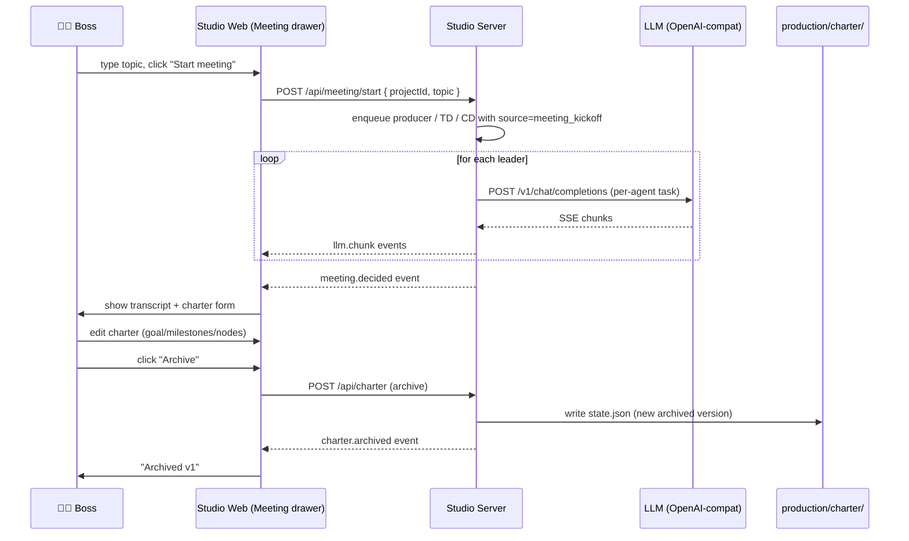
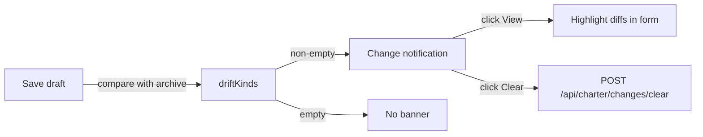

# 06 · 会议室与项目章程

会议室是 AiGameAgent 中最具特色的 UX。在这里，老板与领导层子集（producer / technical-director / creative-director）会面，就某个议题展开讨论，编辑章程，并归档某个版本。章程将成为下游工作所遵循的规范。

**Source:** `apps/studio-web/src/main.ts`（`setupMeetingUI`）+ `apps/studio-server/src/index.ts`（章程状态、会议 API、领导层入队）

## 为什么要会议室？

大多数 AI 开发工具都从「输入提示词」开始。AiGameAgent 则从**「我们要构建什么？」**开始。会议室是老板**在写任何代码之前**用的第一个东西。

领导层子集（3 位 Agent）是会议中唯一发言的 Agent。它们各司其职：

| 发言人 | 提问 | 关注点 |
|---------|------|-----------|
| Producer | 「我们到底要交付的**那一个**东西是什么？一句话讲清楚。」 | 目标清晰度、范围、里程碑 |
| Technical Director | 「用什么模型、什么算力、风险是什么？」 | 提供方选择、并发工作、延迟 |
| Creative Director | 「玩家的幻想是什么？『完成』长什么样？」 | 验收标准、预览把关 |

老板居中裁断：撰写章程、归档，然后由 producer 链启动后续工作。

## 会议流程



## 章程数据模型

```ts
type CharterBody = { goal: string; milestones: string[]; nodes: string[] };
type CharterArchived = CharterBody & { version: number; archivedAt: string };
type PerProjectCharter = { draft: CharterBody; archived: CharterArchived | null; history: CharterArchived[] };
type CharterRootState = { projects: Record<string, PerProjectCharter>; pendingChanges: Record<string, PendingChange> };
type PendingChange = { kinds: string[]; count: number; updatedAt: string; lastNotifyTs?: string };
```

- **draft**：老板当前正在编辑的内容
- **archived**：最新的「冻结」版本（从未归档过则为 `null`）
- **history**：所有归档版本的栈
- **pendingChanges**：供 UI 用的漂移类型记录

状态持久化到 `production/charter/state.json`（gitignored）。

## 会议与章程的 REST 接口

| Method | Path | 用途 |
|--------|------|---------|
| `POST` | `/api/meeting/start` | 启动一次领导层会议（可带 `topic`） |
| `GET` | `/api/meeting/llm_ping` | 测试会议提供方是否可达 |
| `GET` | `/api/charter?projectId=X` | 读取项目 X 的 draft + archived + history |
| `POST` | `/api/charter` | 保存 draft（action: `save_draft`）或归档（action: `archive`） |
| `GET` | `/api/charter/changes?projectId=X` | 读取待处理变更（漂移类型） |
| `POST` | `/api/charter/changes/clear` | 清除项目的待处理变更 |

## 解析领导层会议记录

LLM 输出总是杂乱的。服务端提供三个解析器，按顺序尝试：

```ts
function parseMeetingTranscriptAny(rawAssistant: string) {
  return parseMeetingTranscriptJson(raw) ?? parseMeetingTranscriptLoose(raw);
}
```

1. **JSON** —— 对 `{ lines: [{ speaker, text }] }` 进行严格的 `JSON.parse`
2. **代码块 JSON** —— 去掉 ```` ```json ... ``` ```` 围栏后再 `JSON.parse`
3. **外层切片** —— `sliceOutermostJsonObject()` 从散文里抠出第一个 `{...}`

如果 JSON 解析全部失败，则启用宽松解析器：

```ts
const allowed = /^(Secretary|Producer|Technical Director|Creative Director)\s*[:：]\s*(.+)$/;
```

它匹配「发言人 + 冒号（全角 `：` 或半角 `:`）」，每行一条。匹配到三行及以上即视为会议记录。这种设计是为了照顾那些忽略 JSON 输出格式的小型本地模型。

## 「自动开局」复选框

会议室 Tab 里有一个 `meetingAutoKickoff` 复选框。勾选后，`charter.archived` 一旦触发，服务端会自动入队 producer 链：

```ts
if (meetingAutoKickoff && ev.type === "charter.archived") {
  // Enqueue producer → designer → programmer → artist → QA
}
```

秘书 HUD 会报告：「开局首版完成后，design / programming / art / QA 的跟进任务会自动入队」。

## 章程漂移 UI



漂移类型：

- `goal_changed` —— `draft.goal.trim() !== archived.goal.trim()`
- `milestones_changed` —— 归一化后的里程碑数组的 JSON.stringify 不同
- `nodes_changed` —— 归一化后的 nodes 数组的 JSON.stringify 不同
- `first_archive` —— 从未归档过，但 draft 已有内容

UI 会展示：`Pending drift: goal_changed, milestones_changed（合计 3）`。`count` 是当前 draft 累计记录的漂移次数（这样老板就知道 draft「一直在晃」）。

## 跳过 LLM 的会议（「规则」模式）

有时候老板不想走 3 个 LLM 的轮询。会议室抽屉里有一个 `meetingSkipLlm` 复选框；勾上后，会议记录会用**预置的规则化内容**，不再调用 LLM。

两种模式对应 `producer.mode` 与 `creativeDirector.mode` 的策略字段：

- `mode: "rules"` —— 会议室抽屉使用预置提示
- `mode: "llm"` —— 会议室抽屉调用会议提供方（默认：`cloud`）

三个层级的默认策略都是 `"rules"`——改为 `"llm"` 以启用 LLM 驱动路径。

## 会议室抽屉内的项目切换

抽屉里有一个 `meetingProject` 选择器。切换时会触发：

1. `setCurrentProjectGlobal(pid)`（写入 `window.__STUDIO_CURRENT_PROJECT__`）
2. `refreshCharter()` —— 重新拉取 `/api/charter?projectId=...`
3. `refreshCharterChanges()` —— 重新拉取 `/api/charter/changes?projectId=...`

这意味着同一套 UI 可用于管理多个项目（例如同时跑「Snake MVP」与「Card Game Spinoff」）。

## 规范中点出的边界场景

来自 `studio-meeting-room/spec.md`：

> **Scenario: Repeatedly clicking the Start button**
> - **WHEN** the boss clicks "Start meeting" again while a meeting is still in progress
> - **THEN** the system SHALL ignore the second click (to avoid generating duplicate transcripts)

> **Scenario: LLM parse failure**
> - **WHEN** none of the three directors' LLM outputs can be parsed by any parser
> - **THEN** the system SHALL show an error and leave the transcript area empty (rather than crash)

> **Scenario: Kickoff meeting with no LLM**
> - **WHEN** "Skip LLM" is checked and Start is clicked
> - **THEN** the system SHALL fill the transcript with built-in templates and let the boss edit the charter directly

## 接下来

- [OpenSpec 变更控制](/docs/05-openspec) —— 章程所在的更大规范体系
- [监控与 H5 预览](/docs/07-monitor-and-preview) —— producer 链完成后会保存什么
- [财务与模型路由](/docs/09-finance-and-routing) —— 会议提供方是如何选定的
