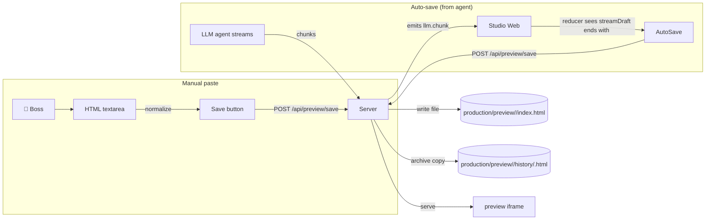

# 07 · 监控与 H5 预览

监控面板是老板观察当前项目交付物的窗口。它是一个 iframe，指向服务器提供的 HTML 文件，旁边还挂着一个侧栏用于历史、回滚，以及一个支持手动粘贴的文本框。

**Source:** `apps/studio-web/src/main.ts`（`setupMonitorUI`）· `apps/studio-server/src/index.ts`（预览路由）

## 两条进入预览的路径



## 文件布局

```
production/preview/
└── <projectId>/
    ├── index.html            # current preview (served by /preview)
    ├── history/
    │   ├── 2026-06-12T03-21-44.html
    │   ├── 2026-06-12T03-25-11.html
    │   └── ...
    └── assets/
        └── gen/
            └── run_<hex>/    # from studioGenerateImages
                ├── 0.png
                ├── 1.png
                └── ...
```

`projectId` 在参与任何路径拼接之前都会被清洗为 `[a-zA-Z0-9_-]`，从根本上杜绝目录穿越。

## HTML 归一化（「老板贴了一段 markdown 围栏」的问题）

LLM（以及从聊天里粘贴的人类）经常把 HTML 裹在 markdown 围栏里，或者在前面加一段散文。客户端的 `normalizePreviewHtmlInput()` 函数尝试三种形态：

```ts
function normalizePreviewHtmlInput(raw: string): { html: string; hint?: string } {
  // 1. Strip ```html ... ``` fences
  const fence = trimmed.match(/^```(?:html)?\s*([\s\S]*?)\s*```$/i);
  if (fence?.[1]) return { html: fence[1].trim(), hint: "已自动去掉 ``` 代码块包裹" };

  // 2. If there's a <!doctype html> or <html> mid-string, slice from there
  const docStart = trimmed.search(/<!doctype\s+html|<html[\s>]/i);
  if (docStart > 0) {
    return { html: trimmed.slice(docStart).trim(), hint: "已从文本中提取 <html> 文档片段" };
  }

  // 3. Use as-is
  return { html: trimmed };
}
```

如果某条提示被触发，秘书 HUD 会把它记下来。这正是「保存成功」与「老板贴了一段 5 页的聊天回复，纳闷预览为什么是空白」之间的差别。

## 服务端路由

| Method | Path | 用途 |
|--------|------|---------|
| `GET` | `/preview?projectId=X[&v=file.html]` | 提供 `index.html`（默认）或某个具体的历史文件 |
| `POST` | `/api/preview/save` | 为某项目保存 HTML（自动入历史） |
| `GET` | `/api/preview/history?projectId=X` | 列出历史文件（最新在前） |
| `POST` | `/api/preview/restore` | 把某个历史文件拷回 `index.html` |

保存端点强制 20 个字符的最小长度：

```ts
if (html.length < 20) return { ok: false, error: "html_too_short" };
```

这能拦截空粘贴 / 仅空白的粘贴。

## 自动保存检测（「魔法」）

每次 `llm.message_done` 之后，客户端会检查：Agent 的 `summary`（完整消息）里是否包含一份完整的 HTML 文档？

```ts
function extractHtmlDocFromText(raw: string): string | null {
  const n = normalizePreviewHtmlInput(raw).html;
  if (!n) return null;
  const hasStart = /<!doctype\s+html/i.test(n) || /<html[\s>]/i.test(n);
  const hasEnd = /<\/html>/i.test(n);
  if (!hasStart || !hasEnd) return null;
  if (n.length < 200) return null;
  return n;
}

// In the reducer's onMessageDone handler:
const htmlDoc = aid ? extractHtmlDocFromText(this.state.agents[aid]?.summary ?? "") : null;
if (htmlDoc) {
  fetch(`${this.studio.http}/api/preview/save`, {
    method: "POST",
    headers: { "content-type": "application/json" },
    body: JSON.stringify({ html: htmlDoc, projectId: pid })
  });
  setSecretaryHud(`已自动保存 HTML。预览 ${url}`);
}
```

200 字符的最小长度是一个务实下限：一个 `<!doctype html></html>` 加 200 字符是「最小有意义的页面」。

## 监控面板中的项目切换

监控面板自带一个 `monitorProject` 选择器。切换时：

1. 调用 `POST /api/projects/select` 将其标记为当前项目
2. 更新 iframe 的 `src` 为 `/preview?projectId=X`
3. 重新加载历史列表
4. 设置 `window.__STUDIO_CURRENT_PROJECT__`，供其他面板拾取

自动保存事件监听器（`studio-preview-saved`）也会在「老板当前未查看的项目收到了保存事件」时，反向同步项目选择器。

## 历史与回滚

每次保存**同时**会写一份带时间戳的副本：

```ts
const ts = new Date().toISOString().replace(/[:.]/g, "-");
const histFile = join(previewDir, pid, "history", `${ts}.html`);
await writeFile(histFile, html, "utf8");
```

历史列表按时间倒序展示。点击文件名会在 iframe 中加载该版本（不会覆盖 `index.html`）。点击「回滚为当前版本」则把该文件拷回 `index.html`——当 Agent 最新输出出现回退时很有用。

## 失败展示

如果 `studio-failures-refresh` 触发（在 `job.failed` 或 `ok: false` 的 `job.finished` 之后），监控面板会重新拉取 `/api/studio/failures?limit=25`，在侧栏展示最近 25 条失败——每条都带「复制 ID」按钮，便于拷贝 `correlationId` 调试。

失败列表的形态：

```ts
{
  ts: string;
  type: "job.failed" | "job.finished";
  correlationId: string;
  agentId?: string;
  payload: { message?: string; error?: string; failureReason?: string };
}
```

## 为什么要 iframe，而不是 innerHTML？

1. **CSP 安全** —— 保存的 HTML 可能包含 `<script>`、`eval`、跨域 `fetch`。iframe 天然是（同源）沙箱，且可以按响应单独加 CSP
2. **重置语义清晰** —— 想「重载」预览，只需要改 `iframe.src`（或 `&v=` 查询串）。用 `innerHTML` 的话，必须先拆掉旧 DOM，还要担心事件监听泄漏
3. **Agent 上下文不会泄漏到宿主应用** —— Agent 输出待在 iframe 的世界里；Agent 的 `setTimeout(alert, 1000)` 不会影响宿主页

代价：同源 iframe 会继承宿主页的 cookie / localStorage。缓解方式是**不带凭据加载预览**，并保持所提供 HTML 的可信（这是老板自己的输出，而非第三方）。

## 接下来

- [资源管道](/docs/08-asset-pipeline) —— 图像 / 精灵表 / 视频是如何与预览一起存储的
- [财务与模型路由](/docs/09-finance-and-routing) —— 自动保存的成本长什么样
- [完整 API 参考](/docs/13-api-reference) —— 预览 API 全貌
