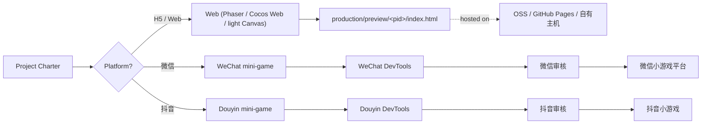

# 11 · H5 & Mini-Game Platforms

AiGameAgent's primary deliverable is **multi-platform mini-games**: HTML5 page games (browser, mobile web), WeChat mini-games (微信小游戏), and Douyin mini-games (抖音小游戏). The platform choice is **per-project**; the studio includes specialists for each.

**Source:** `apps/studio-web` (H5 Phaser) + `.claude/agents/web-h5-specialist.md` + `.claude/agents/wechat-minigame-specialist.md` + `.claude/agents/douyin-minigame-specialist.md` + `setup-web` / `setup-wechat-minigame` / `setup-douyin-minigame` skills

## Three delivery targets



## H5 (Web) — the default

The web path is the simplest because:

- The studio's `studio-web` already uses Phaser + Vite
- The "Monitor" drawer's iframe is the H5 preview
- Any HTML output (with `<!doctype html>`) is shippable as-is

The web specialist (`web-h5-specialist`) handles:

- Phaser scenes, scenes lifecycle, asset loading
- Mobile-first viewport (`<meta name="viewport" content="width=device-width,initial-scale=1">`)
- Touch input + pointer events
- Frame budget (60fps on mid-range mobile)
- Local storage / IndexedDB for save data
- Web Audio for sound

Engine selection (`.claude/docs/technical-preferences.md`):

| Engine | Use when |
|--------|----------|
| **Phaser 3** | 2D top-down / side-scroller, scene-based, fast iteration |
| **Cocos Web** | If the team already knows Cocos; richer editor |
| **Light Canvas** | Pure `<canvas>` + game loop, no engine dep (smallest bundle) |

The default in the shipped code is **Phaser** (see `apps/studio-web/src/main.ts`'s import). The `setup-web` skill walks through switching engines.

## 微信小游戏 (WeChat mini-game)

The WeChat path adds constraints:

- The runtime is **not a browser** — it's a sandboxed JS engine (V8 with restrictions)
- The global is `wx`, not `window` (so the studio's own code must not use `window` in shipped code)
- File access is limited; assets must be packaged into the `game.js` or fetched from the official CDN
- The `wx` API surface is documented at <https://developers.weixin.qq.com/minigame/dev/api/>

The wechat specialist (`wechat-minigame-specialist`) handles:

- `wx.createCanvas()` for the main canvas
- `wx.onTouchStart` / `wx.onTouchEnd` for input
- `wx.getStorageSync` / `wx.setStorageSync` for saves
- `wx.request` for HTTP (with whitelist-only domains)
- `wx.shareAppMessage` for sharing
- The `game.json` manifest (deviceOrientation, networkTimeout, etc.)
- WeChat DevTools project structure

A `.claude/skills/setup-wechat-minigame/` skill walks through:

1. Installing WeChat DevTools
2. Importing the project (`project.config.json`)
3. Configuring the appid
4. Adapting `window` → `wx` references
5. Submitting for review

> **The cardinal rule**: "禁止臆造 `wx` 方法签名" — only use APIs documented by WeChat or already typed in the repo. The `wx.d.ts` shipped with the DevTools is the source of truth.

## 抖音小游戏 (Douyin mini-game)

Douyin mini-games use the **Bytedance MicroApp** runtime, which is similar to WeChat's:

- Global is `tt` (not `window` or `wx`)
- Similar API shape to WeChat (`tt.createCanvas`, `tt.onTouchStart`, `tt.getStorageSync`)
- The Douyin DevTools project is separate
- Distribution is via 抖音开放平台 (Douyin Open Platform)

The douyin specialist (`douyin-minigame-specialist`) handles the same scope as the WeChat specialist, just with `tt` and Douyin-specific manifest fields.

> Same cardinal rule: "禁止臆造 `tt` API" — only what the docs or repo typings say.

## Shared logic

The `STUDIO.md` and `docs/COLLABORATIVE-DESIGN-PRINCIPLE.md` are explicit:

> **共享逻辑**: `packages/shared/` (or `src/shared/`); 平台代码不得从 `src/web/` 直接引用微信/抖音全局对象。

Concretely:

- Game rules, level data, save schema live in `packages/shared/` (or per-platform `shared/`)
- The H5 implementation uses `window` / `document` / Phaser
- The WeChat implementation uses `wx` + a thin Phaser shim
- The Douyin implementation uses `tt` + the same Phaser shim
- The shim is a `platform/wx-shim.ts` (or similar) — small, no logic, just renames

A common pattern:

```ts
// packages/shared/src/platform.ts
export interface Platform {
  readonly kind: "h5" | "wechat" | "douyin";
  getStorage(key: string): string | null;
  setStorage(key: string, value: string): void;
  share(payload: SharePayload): Promise<void>;
  vibrate(durationMs: number): void;
}
```

Each platform implements the interface; game code takes a `Platform` via DI.

## Why the studio includes platform specialists

The studio's mental model is: **a game is a small studio's output**. Studios that ship to multiple platforms have:

- A generalist (gameplay programmer) who works on shared code
- A platform lead (release-manager) who handles submission
- A platform specialist (wechat-specialist, douyin-specialist) who knows the runtime quirks

AiGameAgent mirrors this — the platform specialists are first-class agents that:

- Know the platform's `global` object name
- Know the manifest format
- Know the DevTools workflow
- Know the submission review process
- Have a `setup-<platform>` skill that walks through onboarding

## Mini-game release checklist

A 5-step release flow that the `release-checklist-minigame` skill encodes:

1. **Manifest** — `game.json` (WeChat) or `project.config.json` (Douyin) is filled in with the right orientation, network timeout, subpackages if any
2. **Icons** — 144×144 (WeChat) / 144×144 (Douyin) icon PNGs
3. **Privacy policy URL** — required for both stores
4. **Test in DevTools** — emulator + real device (when possible)
5. **Submit for review** — WeChat: 1-3 days; Douyin: 1-7 days

## Asset format constraints

| Platform | Audio format | Image format | Max bundle |
|----------|--------------|--------------|-----------|
| WeChat | mp3, ogg | png, jpg (no svg in v1) | 4 MB main + 200 MB subpackage |
| Douyin | mp3 | png, jpg | 4 MB main + 200 MB subpackage |
| H5 | any (browser-supported) | any | n/a |

The asset pipeline (`/docs/08-asset-pipeline`) produces PNGs in the preview tree; the platform specialists copy / convert to the platform-specific bundle.

## The H5 fast path

For a quick H5 prototype (e.g. a 2-hour mini-jam), the studio supports a zero-config flow:

1. Boss starts a meeting with topic "做一个贪吃蛇变体"
2. Producer chain fires
3. Gameplay programmer outputs HTML to the meeting transcript
4. Auto-save detects `<html>...</html>` and writes to `production/preview/<pid>/index.html`
5. Monitor iframe shows the playable game
6. Boss saves the HTML, drags it to a static host (or hits "open" to launch in a new tab)

Total time from "topic" to "playable" is typically **5-15 minutes** for a simple game with a 7B model.

## Next

- [Local LLM Integration](/docs/10-local-llm) — when the LLM is the game (text adventures, etc.)
- [Agent Roster & Departments](/docs/04-agents-and-departments) — full list of platform specialists
- [Tech Stack](/tech-stack) — the engine matrix in detail
