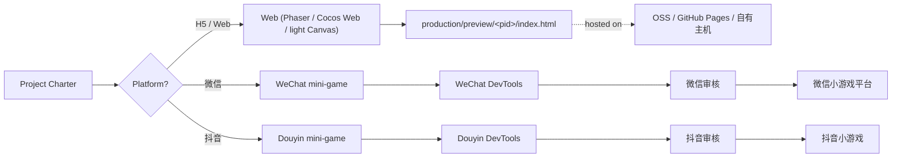

# 11 · H5 与小游戏平台

AiGameAgent 的主要交付物是**多平台小游戏**：HTML5 页游（浏览器、移动 Web）、微信小游戏、抖音小游戏。平台选择是**按项目**决定的；工作室为每个平台都配备了专员。

**源码：** `apps/studio-web`（H5 Phaser）+ `.claude/agents/web-h5-specialist.md` + `.claude/agents/wechat-minigame-specialist.md` + `.claude/agents/douyin-minigame-specialist.md` + `setup-web` / `setup-wechat-minigame` / `setup-douyin-minigame` 这几个 skill

## 三种交付目标



## H5（Web）—— 默认选项

Web 路径最简单，原因在于：

- 工作室的 `studio-web` 已经使用了 Phaser + Vite
- "Monitor" 抽屉中的 iframe 就是 H5 预览
- 任何带 `<!doctype html>` 的 HTML 输出都可以原样发布

Web 专员（`web-h5-specialist`）负责：

- Phaser 场景、场景生命周期、资源加载
- 移动优先的 viewport（`<meta name="viewport" content="width=device-width,initial-scale=1">`）
- 触屏输入 + pointer 事件
- 帧预算（中端手机上 60fps）
- 用 local storage / IndexedDB 保存数据
- 用 Web Audio 播放声音

引擎选择（见 `.claude/docs/technical-preferences.md`）：

| 引擎 | 适用场景 |
|--------|----------|
| **Phaser 3** | 2D 俯视/横版卷轴、场景化、快速迭代 |
| **Cocos Web** | 团队已熟悉 Cocos；编辑器更丰富 |
| **Light Canvas** | 纯 `<canvas>` + 游戏循环，无引擎依赖（包体最小） |

已发布代码中的默认是 **Phaser**（见 `apps/studio-web/src/main.ts` 中的 import）。`setup-web` skill 会引导你切换引擎。

## 微信小游戏

微信路径会带来额外约束：

- 运行时**不是浏览器**——它是一个带限制的沙盒化 JS 引擎（V8 的受限版）
- 全局对象是 `wx` 而非 `window`（所以工作室自身的代码在发布版本中不能使用 `window`）
- 文件访问受限；资源必须打包进 `game.js`，或从官方 CDN 获取
- `wx` 的 API 表面见 <https://developers.weixin.qq.com/minigame/dev/api/>

微信专员（`wechat-minigame-specialist`）负责：

- `wx.createCanvas()` 创建主画布
- `wx.onTouchStart` / `wx.onTouchEnd` 处理输入
- `wx.getStorageSync` / `wx.setStorageSync` 处理存档
- `wx.request` 处理 HTTP（仅允许白名单内的域名）
- `wx.shareAppMessage` 处理分享
- `game.json` 清单（deviceOrientation、networkTimeout 等）
- 微信开发者工具的项目结构

`.claude/skills/setup-wechat-minigame/` skill 会引导：

1. 安装微信开发者工具
2. 导入项目（`project.config.json`）
3. 配置 appid
4. 将 `window` 引用适配为 `wx`
5. 提交审核

> **铁律**："不要凭空捏造 `wx` 的方法签名"——只使用微信官方文档中记载的，或仓库里已声明类型的 API。开发者工具自带的 `wx.d.ts` 是唯一的真值来源。

## 抖音小游戏

抖音小游戏使用**字节跳动小程序（Bytedance MicroApp）**运行时，与微信类似：

- 全局对象是 `tt`（不是 `window` 也不是 `wx`）
- API 形态与微信类似（`tt.createCanvas`、`tt.onTouchStart`、`tt.getStorageSync`）
- 抖音开发者工具是独立的项目
- 分发走 抖音开放平台

抖音专员（`douyin-minigame-specialist`）的职责范围与微信专员相同，只是换成 `tt` 和抖音特有的清单字段。

> 同样的铁律："不要凭空捏造 `tt` 的 API"——只使用文档或仓库类型中记载的。

## 共享逻辑

`STUDIO.md` 和 `docs/COLLABORATIVE-DESIGN-PRINCIPLE.md` 都明确指出：

> **共享逻辑**：放在 `packages/shared/`（或 `src/shared/`）；平台代码**严禁**在 `src/web/` 中直接引用微信/抖音的全局对象。

具体来说：

- 游戏规则、关卡数据、存档 schema 放在 `packages/shared/`（或各平台自己的 `shared/`）
- H5 实现使用 `window` / `document` / Phaser
- 微信实现使用 `wx` + 一层薄薄的 Phaser 适配
- 抖音实现使用 `tt` + 同一份 Phaser 适配
- 适配层写在 `platform/wx-shim.ts`（或类似）—— 小而没有逻辑，只做改名

一个常见模式：

```ts
// packages/shared/src/platform.ts
export interface Platform {
  readonly kind: "h5" | "wechat" | "douyin";
  getStorage(key: string): string | null;
  setStorage(key: string, value: string): void;
  share(payload: SharePayload): Promise<void>;
  vibrate(durationMs: number): void;
}
```

每个平台都实现该接口；游戏代码通过 DI 拿到一个 `Platform`。

## 为什么工作室要包含平台专员

工作室的心智模型是：**一款游戏就是一家小工作室的产出**。会向多平台发布的工作室通常设有：

- 通才（gameplay 程序员），负责共享代码
- 平台负责人（发布经理），负责提审
- 平台专员（微信专员、抖音专员），熟悉运行时的各种坑

AiGameAgent 镜像了这一结构——平台专员是一类一等公民的 Agent，它们：

- 知道平台的 `global` 对象名
- 知道清单的格式
- 知道开发者工具的流程
- 知道提审的审核流程
- 带有一个 `setup-<platform>` skill，引导完成接入

## 小游戏发布清单

`release-checklist-minigame` skill 编码了 5 步发布流程：

1. **清单** —— 填写 `game.json`（微信）或 `project.config.json`（抖音），包括正确的方向、网络超时、是否分包等
2. **图标** —— 144×144（微信）/ 144×144（抖音）的 PNG 图标
3. **隐私政策链接** —— 两个商店都必填
4. **在开发者工具中测试** —— 模拟器 + 真机（如可能）
5. **提交审核** —— 微信：1-3 天；抖音：1-7 天

## 资源格式约束

| 平台 | 音频格式 | 图片格式 | 包体上限 |
|----------|--------------|--------------|-----------|
| 微信 | mp3、ogg | png、jpg（v1 不支持 svg） | 主包 4 MB + 子包 200 MB |
| 抖音 | mp3 | png、jpg | 主包 4 MB + 子包 200 MB |
| H5 | 任意（浏览器支持） | 任意 | 不限 |

资源管线（`/docs/08-asset-pipeline`）会在预览目录中生成 PNG；平台专员会负责将其复制/转换为平台专用的包体。

## H5 快速通道

对于一个快速 H5 原型（例如 2 小时的 mini-jam），工作室支持零配置流程：

1. 老板发起一个会议，主题是 "做一个贪吃蛇变种"
2. Producer 链触发
3. Gameplay 程序员把 HTML 输出到会议纪要中
4. 自动保存检测到 `<html>...</html>`，并写入 `production/preview/<pid>/index.html`
5. Monitor 的 iframe 即可展示可玩游戏
6. 老板保存 HTML，拖到静态主机（或点"在新标签页打开"）

从一个"主题"到一个"可玩游戏"，对于简单游戏配合 7B 模型，通常 **5-15 分钟**即可完成。

## 接下来

- [本地大模型集成](/docs/10-local-llm) —— 当 LLM 本身就是游戏时（文字冒险等）
- [Agent 名册与部门](/docs/04-agents-and-departments) —— 平台专员的完整列表
- [技术栈](/tech-stack) —— 引擎矩阵的细节
