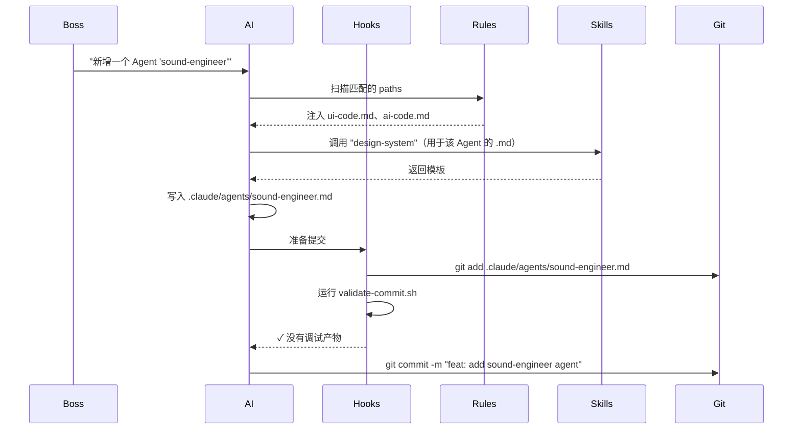

# 12 · 钩子、规则与 Skill

AiGameAgent 的"仪式（ceremony）"分布在三个地方：**钩子（hook）**（生命周期脚本）、**规则（rule）**（按路径作用域生效的风格/架构规则）、以及 **skill**（AI 可以调用的可复用流程）。三者结合，让同一个 AI 在面对引擎代码和 UI 代码时表现迥异，并能在没有文档的情况下引导新人走完设置流程。

**源码：** `.claude/hooks/*.sh`（6 个脚本）· `.claude/rules/*.md`（7 条规则）· `.claude/skills/*/SKILL.md`（44 个 skill）

## 钩子

钩子是一个 shell 脚本，由 AI 运行时在某个生命周期时刻调用。工作室自带 6 个：

| 钩子 | 触发时机 | 作用 |
|------|------|--------------|
| `session-start.sh` | 会话开始 | 弹出上下文、设置工作目录、显示横幅 |
| `pre-compact.sh` | 上下文压缩前 | 快照未提交的本地状态 |
| `session-stop.sh` | 会话结束 | 清理、写入 session 日志 |
| `log-agent.sh` | 每次 Agent 调用后 | 将 Agent 调用追加到 `production/session-logs/` |
| `validate-assets.sh` | 提交前（若改动到资源） | 检查 PNG 尺寸、文件大小限制 |
| `validate-commit.sh` | 提交前 | 若留下 `console.log` / `.only` / `debugger` 则拦截 |
| `validate-push.sh` | 推送前 | 运行 `studio-e2e-smoke.mjs` |
| `detect-gaps.sh` | 周期性 | 扫描无人认领的 TODO/FIXME 标记 |

> 注意：这里列了 8 个名字对应 6 个文件，其中部分是复用的。实际发布的集合在 `.claude/hooks/`。

### 示例：`validate-commit.sh`

```bash
#!/usr/bin/env bash
set -euo pipefail

# 拦截会留下调试产物的提交
if git diff --cached --name-only | xargs -I {} grep -lE '(console\.log|debugger|\.only\()' {} 2>/dev/null; then
  echo "❌ Found console.log / debugger / .only in staged files"
  exit 1
fi

# 拦截对禁止路径的修改
if git diff --cached --name-only | grep -E '^(production/|\.env)'; then
  echo "❌ Commit blocked: production/ and .env are gitignored"
  exit 1
fi
```

钩子返回非零值即**阻止**这次提交。AI 运行时会把消息上浮并停止操作。

## 规则

规则是一个带 YAML `paths:` 字段的 Markdown 文件，表示"这条规则适用于匹配这些 glob 的文件"。工作室有 7 条：

| 规则 | 适用路径 | 要点 |
|------|-----------|-----------|
| `engine-code.md` | `src/core/**` | "热路径中零分配" |
| `gameplay-code.md` | gameplay 路径 | "确定性优先于速度；存档/读档必须可往返" |
| `ui-code.md` | UI 路径 | "一个文件一个组件，JSX 中不要内联样式" |
| `shader-code.md` | shader 路径 | "优化前后都要 profile；记录测得的数字" |
| `network-code.md` | netcode 路径 | "显式声明 tick-rate；reconciliation 必须幂等" |
| `design-docs.md` | `design/gdd/**` | "每篇文档必须包含 8 个章节：Overview、Player Fantasy、Detailed Rules、Formulas、Edge Cases、Dependencies、Tuning Knobs、Acceptance Criteria" |
| `ai-code.md` | `src/ai/**` | "行为树必须能终止；blackboard 写入需记录" |
| `data-files.md` | JSON / YAML | "必须有 schema 校验；没有 schema 一律不合入" |
| `narrative.md` | narrative 路径 | "分支树必须可从至少一个根节点到达" |
| `prototype-code.md` | `src/prototype/**` | "一次性代码：不写测试、不写注释，允许破坏" |
| `test-standards.md` | tests | "主分支不允许 skip 测试；flaky 测试必须隔离" |

（注：这里是 11 条规则，不是 7 条——其中一些只对当前 JS-only 构建中不存在的引擎类型生效。）

### 规则的结构

```markdown
---
paths:
  - "src/core/**"
---

# 引擎代码规则

- 热路径（update 循环、渲染、物理）中零分配 —— 预分配、池化、复用
- 所有引擎 API 必须线程安全，或显式注明仅单线程使用
- 每次优化前后都要 profile —— 记录测得的数字
- 引擎代码不得依赖 gameplay 代码（依赖方向严格：engine <- gameplay）
- 每个公开 API 必须在文档注释中给出使用示例
- 公开接口的变更需要经过一段弃用期，并提供迁移指南
- 所有资源使用 RAII / 确定性清理
- 所有引擎系统必须支持优雅降级
- 编写引擎 API 代码前，先查阅 `docs/engine-reference/` 确认当前引擎版本，并对照参考文档核验 API
```

`paths` 字段对规则做了作用域限定；只有当 AI 触达匹配的文件时，运行时才会把规则注入到上下文中。

## Skill

Skill 是一段**可复用的流程**，AI 可以调用。工作室有 44 个（`.claude/skills/<name>/SKILL.md`）：

| Skill | 作用 |
|-------|--------------|
| `start` | 让新贡献者 / 新会话上手 |
| `start-local` | 与 `start` 相同，但仅针对本地 LLM |
| `setup-engine` | 在 Phaser / Cocos / light Canvas 中挑选并写入 `technical-preferences.md` |
| `setup-web` | 引导 H5 / Web 的设置 |
| `setup-wechat-minigame` | 微信开发者工具的接入 |
| `setup-douyin-minigame` | 抖音开发者工具的接入 |
| `local-llm` | Ollama / vLLM / LM Studio 的安装与模型推荐 |
| `setup-requirements` | 校验所有环境变量和工具是否就位 |
| `brainstorm` | 引导式游戏概念构思（从 0 到结构化） |
| `design-system` | 逐节编写 GDD |
| `design-review` | 跨文档一致性审查 |
| `map-systems` | 将概念拆解为系统 + 依赖 |
| `create-epics` | GDD → Epic（一个系统区域一个 Epic） |
| `create-stories` | Epic → 可实现的 Story 文件 |
| `create-architecture` | 编写主架构文档 |
| `create-control-manifest` | 将架构摊平为可执行项 |
| `architecture-decision` | 编写 ADR |
| `architecture-review` | 校验架构的完整性 |
| `asset-spec` | 单个资源的视觉规范 + AI prompt |
| `asset-audit` | 按命名/大小规范审计资源 |
| `art-bible` | 逐节编写 Art Bible |
| `balance-check` | 校验公式 / 数据文件 |
| `code-review` | 质量 + 架构评审 |
| `consistency-check` | 跨 GDD 实体注册表检查 |
| `content-audit` | GDD 与实现之间的数量核对 |
| `changelog` | 从 git 历史自动生成 changelog |
| `release-checklist` | 发布前就绪检查 |
| `release-checklist-minigame` | 小游戏发布（微信 / 抖音） |
| `hotfix` | 紧急修复流程 |
| `launch-checklist` | 上线就绪校验 |
| `gate-check` | 阶段门（美术完成 → 代码冻结 → Gold Master） |
| `sprint-plan` | 生成 sprint 计划 |
| `sprint-status` | 快速 sprint 状态检查 |
| `milestone-review` | 里程碑进度回顾 |
| `retrospective` | Sprint 复盘 |
| `scope-check` | 检测范围蔓延 |
| `tech-debt` | 技术债追踪 |
| `regression-suite` | 将测试覆盖率映射到 GDD 关键路径 |
| `perf-profile` | 结构化的性能 profiling |
| `playtest-report` | 撰写 playtest 报告 |
| `localize` | 本地化流水线 |
| `patch-notes` | 面向玩家的补丁说明 |
| `team-*`（release、level、audio、combat、narrative、polish、ui、live-ops） | 多 Agent 编排 |
| `project-stage-detect` | 自动检测项目所处阶段 |
| `onboard` | 为新贡献者生成上手文档 |
| `reverse-document` | 从既有代码反向生成设计/架构文档 |
| `prototype` | 快速原型（跳过常规规范） |
| `platform-diff` | 对比 H5 / 微信 / 抖音 的行为差异 |
| `day-one-patch` | 首日补丁准备 |
| `adopt` | 棕地接入 —— 审计既有产物 |
| `help` | 展示 skill 目录 |
| `skill-test` / `skill-improve` | 校验 / 改进一个 skill |
| `smoke-check` | 提测前的 smoke test |
| `soak-test` | 浸泡测试方案 |
| `qa-plan` | QA 测试计划 |
| `story-done` | Story 结束时的复盘 |
| `story-readiness` | 校验一个 Story 是否可进入实现 |
| `dev-story` | 实现一个 Story 文件 |
| `estimate` | 估算任务工作量 |
| `bug-report` / `bug-triage` | 缺陷上报与分诊 |
| `security-audit` | 安全审计 |
| `test-evidence-review` | 复核测试证据 |
| `test-flakiness` | 检测 flaky 测试 |
| `test-helpers` | 引擎特定的测试辅助 |
| `test-setup` | 搭建测试框架 + CI |
| `ux-design` | 引导式 UX 规范编写 |
| `ux-review` | 校验 UX 规范 |
| `quick-design` | 小改动的轻量规范 |

> skill 的精确数量会浮动（规范/Agent 的划分本身是动态的）；v1 发布时为 44 个。

## Skill 的构成

```markdown
---
name: <id>
description: <one-sentence summary>
---

# <Title>

## When to engage

<Trigger conditions>

## How it works

1. Step 1
2. Step 2
3. ...

## Outputs

- <artefact path>

## Pitfalls

- <known failure mode + mitigation>
```

示例（`setup-engine` 节选）：

```markdown
## When to engage
- 团队准备写一款新游戏
- 用户问"我们该用哪个引擎？"

## How it works
1. 读取 .claude/docs/technical-preferences.md
2. 如果为空，向老板提 3 个问题：
   - 2D 还是 3D？
   - 移动优先还是桌面优先？
   - 团队规模和引擎熟悉程度？
3. 推荐 Phaser（默认）/ Cocos Web / light Canvas
4. 将选择写入 technical-preferences.md
5. 更新 package.json 中的 engines 字段

## Pitfalls
- 若团队只做过 2D，不要选 3D
- 若将来可能用到物理，不要选 light Canvas —— Phaser 自带 Arcade Physics
- 微信小游戏优先选 2D；3D 几乎不被支持
```

## AI 如何使用 skill

运行时会扫描 `.claude/skills/*/SKILL.md` 并对 frontmatter 建索引。然后 AI 可以：

- **列出**："有哪些可用的 skill？" → 运行时会返回索引
- **调用**："运行 `setup-engine`" → 运行时会加载 SKILL.md、按步骤执行、返回产物
- **引用**："展示 `release-checklist-minigame` 的步骤" → 运行时会内联相关 SKILL.md

部分 skill（如 `team-release`）会派生出**子 Agent**，由 AI 编排器协调。这些更重——可能耗时数分钟，并产生多个产物。

## 钩子 + 规则 + Skill 协同工作



顺序如下：

1. **规则** 作为上下文加载（廉价、常驻）
2. **Skill** 按需调用（中等开销，限定在当前任务）
3. **钩子** 在生命周期边界触发（零开销、自动）

## 为什么这是值得拥有的"仪式"

团队的经验是：一个**仪式齐全**的 7B 模型，能跑赢**仪式糟糕**的 70B 模型。仪式的作用：

- 把模型留在作用域内（规则收窄了注意力）
- 引导模型走过一条经过验证的流程（skill 沉淀了团队知识）
- 尽早发现回退（钩子拦截糟糕的提交）
- 让产出保持一致（每个 Agent 文件看起来一样，每份章程章节也一样）

对于一个有 30+ 个 Agent 的工作室，这就是"能帮上忙的 AI"和"每次会话都幻觉出新工作流的 AI"之间的分水岭。

## 接下来

- [架构](/architecture) —— AI 是如何嵌入整体流程的
- [Agent 名册与部门](/docs/04-agents-and-departments) —— 仪式所支撑的 Agent
- [本地大模型集成](/docs/10-local-llm) —— 当 AI 是唯一在跑的东西时
