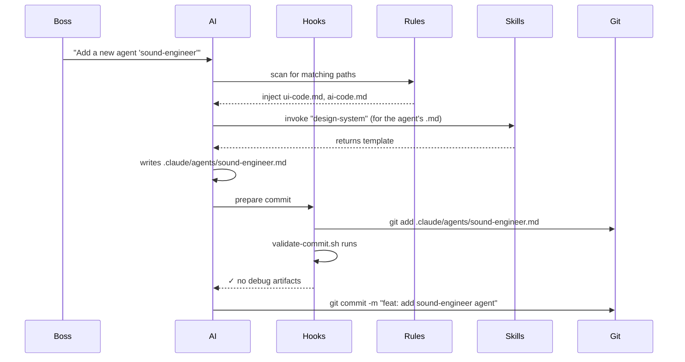

# 12 · Hooks, Rules & Skills

AiGameAgent's "ceremony" lives in three places: **hooks** (lifecycle scripts), **rules** (path-scoped style/architecture rules), and **skills** (reusable procedures the AI can invoke). Together they let the same AI behave differently for engine code vs UI code, and walk a new contributor through a setup without docs.

**Source:** `.claude/hooks/*.sh` (6 scripts) · `.claude/rules/*.md` (7 rules) · `.claude/skills/*/SKILL.md` (44 skills)

## Hooks

A hook is a shell script the AI runner invokes at a lifecycle moment. The studio ships 6:

| Hook | When | What it does |
|------|------|--------------|
| `session-start.sh` | Session start | Eject context, set working dir, show banner |
| `pre-compact.sh` | Before context compaction | Snapshot uncommitted state |
| `session-stop.sh` | Session end | Cleanup, write session log |
| `log-agent.sh` | After each agent invocation | Append the agent call to `production/session-logs/` |
| `validate-assets.sh` | Before commit (if assets touched) | Check PNG dimensions, file size limits |
| `validate-commit.sh` | Before commit | Block if `console.log` / `.only` / `debugger` left in |
| `validate-push.sh` | Before push | Run `studio-e2e-smoke.mjs` |
| `detect-gaps.sh` | Periodic | Scan for unowned TODO/FIXME markers |

> Note: that's 8 names for 6 files; some are reused. The shipped set is in `.claude/hooks/`.

### Example: `validate-commit.sh`

```bash
#!/usr/bin/env bash
set -euo pipefail

# Block commits that leave debug artifacts
if git diff --cached --name-only | xargs -I {} grep -lE '(console\.log|debugger|\.only\()' {} 2>/dev/null; then
  echo "❌ Found console.log / debugger / .only in staged files"
  exit 1
fi

# Block commits that touch forbidden paths
if git diff --cached --name-only | grep -E '^(production/|\.env)'; then
  echo "❌ Commit blocked: production/ and .env are gitignored"
  exit 1
fi
```

The hook returns non-zero to **block** the commit. The AI runner surfaces the message and stops.

## Rules

A rule is a Markdown file with YAML `paths:` that says "this rule applies to files matching these globs". The studio has 7:

| Rule | Applies to | Highlight |
|------|-----------|-----------|
| `engine-code.md` | `src/core/**` | "ZERO allocations in hot paths" |
| `gameplay-code.md` | gameplay paths | "Determinism over speed; save/restore must round-trip" |
| `ui-code.md` | UI paths | "One component per file, no inline styles in JSX" |
| `shader-code.md` | shader paths | "Profile before AND after; document measured numbers" |
| `network-code.md` | netcode paths | "Tick-rate explicit; reconciliation idempotent" |
| `design-docs.md` | `design/gdd/**` | "Every doc MUST have 8 sections: Overview, Player Fantasy, Detailed Rules, Formulas, Edge Cases, Dependencies, Tuning Knobs, Acceptance Criteria" |
| `ai-code.md` | `src/ai/**` | "Behavior trees must terminate; blackboard writes logged" |
| `data-files.md` | JSON / YAML | "Schema-validated; no schema = no merge" |
| `narrative.md` | narrative paths | "Branching trees must be reachable from at least one root" |
| `prototype-code.md` | `src/prototype/**` | "Throwaway code: no tests, no comments, free to break" |
| `test-standards.md` | tests | "No skipped tests in main; flaky tests must be quarantined" |

(That's 11 rules, not 7 — some are scoped to specific engine types not present in the JS-only build.)

### How a rule is structured

```markdown
---
paths:
  - "src/core/**"
---

# Engine Code Rules

- ZERO allocations in hot paths (update loops, rendering, physics) — pre-allocate, pool, reuse
- All engine APIs must be thread-safe OR explicitly documented as single-thread-only
- Profile before AND after every optimization — document the measured numbers
- Engine code must NEVER depend on gameplay code (strict dependency direction: engine <- gameplay)
- Every public API must have usage examples in its doc comment
- Changes to public interfaces require a deprecation period and migration guide
- Use RAII / deterministic cleanup for all resources
- All engine systems must support graceful degradation
- Before writing engine API code, consult `docs/engine-reference/` for the current engine version and verify APIs against the reference docs
```

The `paths` field scopes the rule; the runner injects the rule into context **only** when the AI touches a matching file.

## Skills

A skill is a **reusable procedure** the AI can invoke. The studio has 44 (`.claude/skills/<name>/SKILL.md`):

| Skill | What it does |
|-------|--------------|
| `start` | Onboard a new contributor / new session |
| `start-local` | Same as `start` but for a local-only LLM |
| `setup-engine` | Pick Phaser / Cocos / light Canvas and write the choice into `technical-preferences.md` |
| `setup-web` | Walk through H5 / Web setup |
| `setup-wechat-minigame` | WeChat DevTools onboarding |
| `setup-douyin-minigame` | Douyin DevTools onboarding |
| `local-llm` | Ollama / vLLM / LM Studio setup + model recommender |
| `setup-requirements` | Verify all environment variables and tools are present |
| `brainstorm` | Guided game concept ideation (zero → structured) |
| `design-system` | Section-by-section GDD authoring |
| `design-review` | Cross-doc consistency review |
| `map-systems` | Decompose a concept into systems + dependencies |
| `create-epics` | GDD → epics (one per system area) |
| `create-stories` | Epic → implementable story files |
| `create-architecture` | Author the master architecture doc |
| `create-control-manifest` | Flatten architecture into actionable items |
| `architecture-decision` | Author an ADR |
| `architecture-review` | Validate architecture completeness |
| `asset-spec` | Per-asset visual specification + AI prompt |
| `asset-audit` | Audit assets against naming/size conventions |
| `art-bible` | Author art bible section by section |
| `balance-check` | Validate formulas / data files |
| `code-review` | Quality + architecture review |
| `consistency-check` | Cross-GDD entity registry check |
| `content-audit` | GDD vs implementation counts |
| `changelog` | Auto-generate changelog from git history |
| `release-checklist` | Pre-release readiness |
| `release-checklist-minigame` | Mini-game release (WeChat / Douyin) |
| `hotfix` | Emergency fix workflow |
| `launch-checklist` | Launch readiness validation |
| `gate-check` | Phase gate (art complete → code freeze → gold master) |
| `sprint-plan` | Generate a sprint plan |
| `sprint-status` | Fast sprint check |
| `milestone-review` | Milestone progress review |
| `retrospective` | Sprint retro |
| `scope-check` | Detect scope creep |
| `tech-debt` | Track technical debt |
| `regression-suite` | Map test coverage to GDD critical paths |
| `perf-profile` | Structured performance profiling |
| `playtest-report` | Author a playtest report |
| `localize` | Localization pipeline |
| `patch-notes` | Player-facing patch notes |
| `team-*` (release, level, audio, combat, narrative, polish, ui, live-ops) | Multi-agent orchestration |
| `project-stage-detect` | Auto-detect project stage |
| `onboard` | Generate onboarding doc for a new contributor |
| `reverse-document` | Generate design/architecture docs from existing code |
| `prototype` | Rapid prototyping (skip normal standards) |
| `platform-diff` | Diff H5 / WeChat / Douyin behaviour |
| `day-one-patch` | Day-one patch preparation |
| `adopt` | Brownfield onboarding — audit existing artifacts |
| `help` | Show the skill catalog |
| `skill-test` / `skill-improve` | Validate / improve a skill |
| `smoke-check` | Pre-QA smoke test |
| `soak-test` | Soak test protocol |
| `qa-plan` | QA test plan |
| `story-done` | End-of-story review |
| `story-readiness` | Validate a story is implementation-ready |
| `dev-story` | Implement a story file |
| `estimate` | Estimate task effort |
| `bug-report` / `bug-triage` | Bug reporting and triage |
| `security-audit` | Security audit |
| `test-evidence-review` | Review test evidence |
| `test-flakiness` | Detect flaky tests |
| `test-helpers` | Engine-specific test helpers |
| `test-setup` | Scaffold test framework + CI |
| `ux-design` | Guided UX spec authoring |
| `ux-review` | Validate UX spec |
| `quick-design` | Lightweight spec for small changes |

> The exact count varies (the spec/agent splits are fluid); the v1 shipped count is 44.

## Skill anatomy

```markdown
---
name: <id>
description: <one-sentence summary>
---

# <Title>

## When to engage

<Trigger conditions>

## How it works

1. Step 1
2. Step 2
3. ...

## Outputs

- <artefact path>

## Pitfalls

- <known failure mode + mitigation>
```

Example (excerpt of `setup-engine`):

```markdown
## When to engage
- The team is about to write a new game
- The user asks "which engine should we use?"

## How it works
1. Read .claude/docs/technical-preferences.md
2. If empty, ask the boss 3 questions:
   - 2D or 3D?
   - Mobile-first or desktop?
   - Team size / engine familiarity?
3. Recommend Phaser (default) / Cocos Web / light Canvas
4. Write the choice to technical-preferences.md
5. Update package.json engines field

## Pitfalls
- Don't pick 3D if the team's only experience is 2D
- Don't pick light Canvas if there's a chance of physics — Phaser has Arcade Physics built in
- For 微信小游戏, prefer 2D; 3D is barely supported
```

## How the AI uses skills

The runner scans `.claude/skills/*/SKILL.md` and indexes the frontmatter. The AI can then:

- **List**: "What skills are available?" → the runner returns the index
- **Invoke**: "Run `setup-engine`" → the runner loads the SKILL.md, walks the steps, returns the artefacts
- **Quote**: "Show me the steps in `release-checklist-minigame`" → the runner inlines the relevant SKILL.md

Some skills (like `team-release`) spawn **sub-agents** that the AI orchestrator coordinates. These are heavier — they may take minutes and produce multiple artefacts.

## Hooks + Rules + Skills working together



The order is:

1. **Rules** load as context (cheap, always)
2. **Skills** are invoked on-demand (medium, scoped to the current task)
3. **Hooks** fire at lifecycle boundaries (free, automatic)

## Why this is a "ceremony" worth having

The team's experience is that a 7B model with **good ceremony** outperforms a 70B model with bad ceremony. The ceremony:

- Keeps the model in scope (rules narrow attention)
- Walks the model through a known-good process (skills encode tribal knowledge)
- Catches regressions early (hooks block bad commits)
- Makes outputs consistent (every agent file looks the same, every charter has the same sections)

For a 30+ agent studio, this is the difference between "AI that helps" and "AI that hallucinates new workflows every session".

## Next

- [Architecture](/architecture) — how the AI fits in the overall flow
- [Agent Roster & Departments](/docs/04-agents-and-departments) — the agents the ceremony supports
- [Local LLM Integration](/docs/10-local-llm) — when the AI is the only thing running
