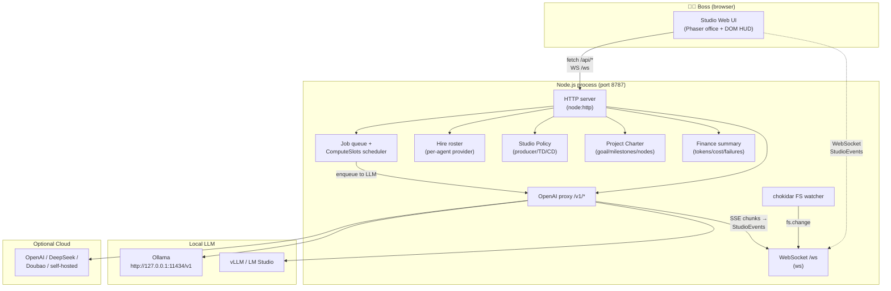
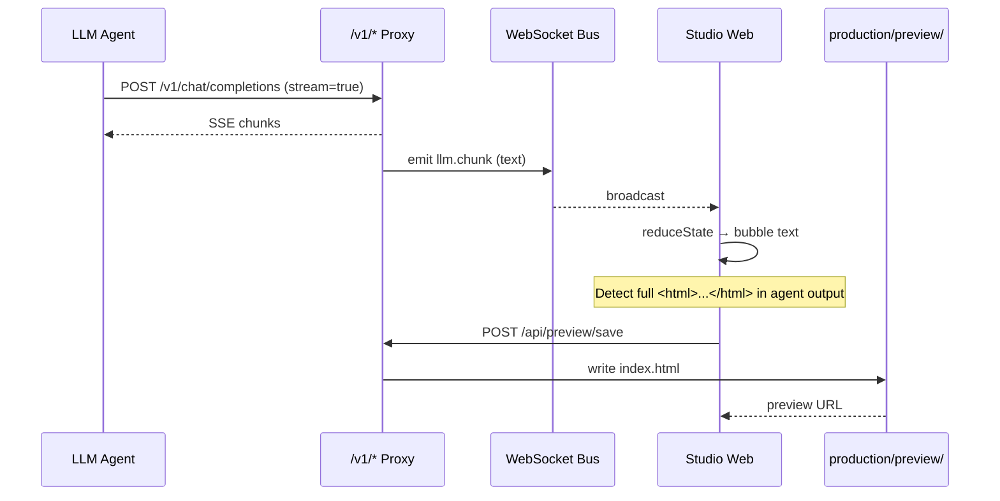
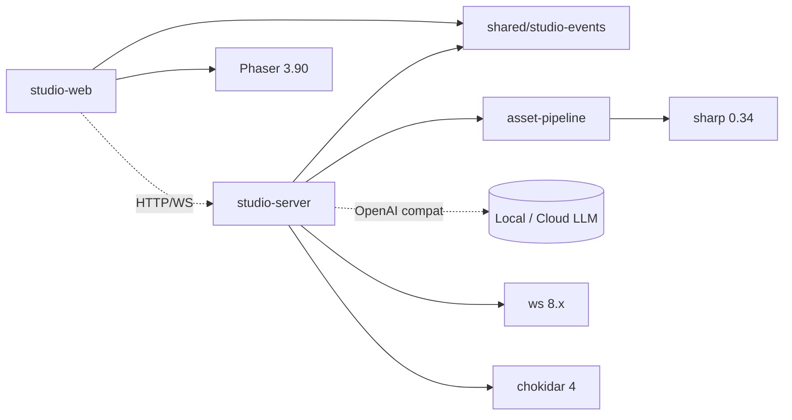

# Architecture

AiGameAgent Studio is a **monorepo with three workspaces** plus an OpenSpec change-control layer, designed to run a small virtual game studio inside a single Node.js process.

## High-level diagram



## Layered breakdown

| Layer | Code | Responsibility |
|------|------|----------------|
| **Presentation** | `apps/studio-web/src/main.ts` (~4,250 LOC) | Phaser isometric office, DOM HUD/drawer, WebSocket client, panel logic |
| **Server core** | `apps/studio-server/src/index.ts` (~3,630 LOC) | HTTP routes, queue, hire, policy, charter, finance, proxy, WebSocket broadcast |
| **Asset pipeline** | `apps/studio-server/src/asset-pipeline.ts` (~280 LOC) | Image gen, sprite-sheet pack, video transcode (sharp + ffmpeg) |
| **Shared types** | `packages/shared/src/studio-events.ts` (~240 LOC) | 25 StudioEvent types, StudioAgentState, reduceState reducer |
| **Change control** | `openspec/` | 9 capability specs + 1 archived change proposal |
| **Agent manifest** | `.claude/agents/*.md` (30 files) | Frontmatter + body declaring each agent's role, tools, scope |
| **Skills library** | `.claude/skills/*/SKILL.md` (44 skills) | Reusable procedures (setup-engine, brainstorm, gate-check, etc.) |
| **Rules** | `.claude/rules/*.md` (7 rules) | Path-scoped style/architecture rules (engine-code, design-docs, etc.) |
| **Hooks** | `.claude/hooks/*.sh` (6 hooks) | SessionStart / PreCompact / session-stop / pre-commit / pre-push gates |

## Request flow example: boss starts a meeting

1. **UI** opens meeting drawer → `POST /api/meeting/start` with `{ projectId, topic }`
2. **Server** constructs a project-specific meeting job → enqueues to producer / TD / CD with `source=meeting_kickoff`
3. **Scheduler** runs the job in `ComputeSlots` (default 1, configurable) → calls LLM via `/v1/chat/completions`
4. **Proxy** streams SSE → emits `llm.chunk` events for each delta
5. **WebSocket** fans out events to all UI clients
6. **UI** reduces state → redraws office → secretary HUD summarises
7. **UI** auto-saves complete HTML output to `production/preview/<projectId>/index.html`

## Request flow example: agent writes HTML preview



## Module dependency graph



## Key abstractions

- **StudioEventEnvelope** — `{ v, ts, type, sessionId, correlationId, agentId?, payload }` is the single type every event uses. 25 typed variants on top of it.
- **Job** — `{ id, agentId, task, priority, createdAt, providerId, projectId, workgroupId, status, source?, producerChainId? }`
- **StudioPolicy** — three tiers: `producer`, `technicalDirector`, `creativeDirector`; each can be `rules` or `llm` mode.
- **Hire roster** — `Set<agentId>`; default loads all 30 agents on first run.
- **Charter** — `{ goal, milestones[], nodes[] }` per project, with `version + archivedAt` snapshot.
- **Provider** — `{ id, label, kind: local|lan|cloud, baseUrl, model, capabilities, pricing }`.

## Workspace layout (annotated)

```
AiGameAgent/
├── apps/
│   ├── studio-server/        # Node.js HTTP+WS, port 8787
│   │   ├── src/index.ts      # main server (3,630 LOC)
│   │   ├── src/asset-pipeline.ts
│   │   └── tsconfig.json
│   └── studio-web/           # Phaser + Vite, dev port 5173
│       ├── src/main.ts       # 4,250 LOC: office + DOM HUD
│       ├── src/style.css
│       ├── index.html
│       └── vite.config.ts
├── packages/
│   └── shared/
│       └── src/studio-events.ts  # 25 event types + reducer
├── .claude/
│   ├── agents/               # 30 role manifests
│   ├── skills/               # 44 SKILL.md procedures
│   ├── rules/                # 7 path-scoped rules
│   ├── hooks/                # 6 lifecycle scripts
│   └── docs/                 # 9 coordination / setup docs
├── openspec/
│   ├── config.yaml
│   ├── specs/                # 9 capability specs
│   └── changes/              # 1 archived change
├── docs/                     # collaboration + e2e checklist
├── production/               # runtime state (gitignored)
├── scripts/                  # studio-e2e-smoke.mjs
├── package.json              # npm workspaces
└── tsconfig.base.json
```

## Next

- See [Tech Stack](/tech-stack) for exact versions and per-module responsibilities.
- Want to read the server code? Start at [Studio Server](/docs/01-studio-server).
- Want to read the client code? Start at [Studio Web](/docs/02-studio-web).
