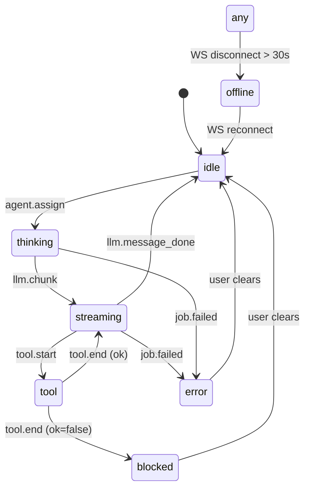

# 03 · Shared Events Bus

The single most important contract in AiGameAgent. Every server-side state change, every LLM chunk, every file edit, every job lifecycle event — all are encoded as a `StudioEventEnvelope` and fanned out to every connected UI.

**Source:** `packages/shared/src/studio-events.ts` (~240 LOC)

## The envelope

```ts
export type StudioEventEnvelope<TType extends StudioEventType = StudioEventType> = {
  v: 1;                 // envelope version
  ts: string;           // ISO-8601 timestamp
  type: TType;          // one of StudioEventType
  sessionId: string;    // server session id (constant for the server lifetime)
  correlationId: string;// per-event id; shared across related events (e.g. one job's chunks)
  agentId?: string;     // which agent triggered this (when applicable)
  payload: Record<string, unknown>;
};
```

Two important rules:

1. **Every event is a single line of JSON** when written to `studio_events.jsonl`
2. **Every event is broadcast to all WebSocket clients** — there is no per-client filtering (yet)

## The 25 event types

| Type | Source | Payload | When |
|------|--------|---------|------|
| `llm.chunk` | proxy | `{ text: string, raw?: unknown }` | Every SSE `data:` line with content |
| `llm.message_done` | proxy | `{}` | On `[DONE]` or end-of-stream |
| `tool.start` | proxy | `{ tool: string, toolCallId?: string }` | SSE `tool_calls` start |
| `tool.end` | proxy | `{ tool: string, toolCallId?: string, ok: boolean }` | On stream end (per active tool) |
| `fs.change` | chokidar | `{ kind: "add"\|"change"\|"unlink"\|..., path: string }` | Repo-root file change |
| `agent.assign` | proxy | `{ task: string }` | Request with `x-studio-agent` + `x-studio-task` headers |
| `policy.decision` | server | `{ action, reason, providerId, from, ... }` | Routing / gating decisions |
| `meeting.started` | server | `{ projectId, topic, ... }` | Boss clicks "Start Meeting" |
| `meeting.decided` | server | `{ projectId, ... }` | Boss confirms a decision |
| `charter.draft_saved` | server | `{ projectId, ... }` | Charter draft save |
| `charter.archived` | server | `{ projectId, version, ... }` | Charter archive |
| `change.detected` | server | `{ projectId, kinds: string[] }` | Draft drift from latest archive |
| `change.cleared` | server | `{ projectId, ... }` | Boss clears pending changes |
| `finance.reset` | server | `{ range: "today" }` | `POST /api/finance/reset` |
| `room.enter` | reserved | `{ roomId: StudioRoomId }` | Agent walks into a room |
| `room.leave` | reserved | `{ roomId: StudioRoomId }` | Agent walks out |
| `job.enqueued` | server | `{ jobId, task, priority, projectId, workgroupId, ... }` | Job pushed to queue |
| `job.started` | server | `{ jobId, providerId, ... }` | Scheduler picks job |
| `job.failed` | server | `{ jobId, stage, message, hint?, failureReason?, ... }` | Upstream/parse error |
| `job.finished` | server | `{ jobId, ok, failureReason?, durationMs?, providerId?, upstreamStatus?, ... }` | Job lifecycle end |
| `asset.image_saved` | asset-pipeline | `{ projectId, runId, files: string[] }` | `studioGenerateImages` success |
| `asset.spritesheet_saved` | asset-pipeline | `{ projectId, output, ... }` | `studioPackSpritesheet` success |
| `asset.pipeline_failed` | asset-pipeline | `{ stage, message }` | Any asset pipeline failure |
| `heartbeat` | server | `{}` | Periodic keep-alive (every ~30s) |

## Reducer (client-side)

`reduceState(prev, ev)` is the **single** state-transition function the front-end uses. Every event enters it; the result is a new `StudioState`.

```ts
export type StudioAgentState = {
  agentId: string;
  status: StudioAgentStatus;       // "idle" | "thinking" | "streaming" | "tool" | "blocked" | "error" | "offline"
  lastTs?: string;
  summary?: string;                // last completed message
  streamDraft?: string;            // in-flight token accumulator (NOT shown in summary)
  roomId?: StudioRoomId;
  jobId?: string;
};

export type StudioState = {
  sessionId: string;
  agents: Record<string, StudioAgentState>;
};
```

The `streamDraft` is intentionally **not** written to `summary` — that prevents the bubble/roster from "rewriting" itself on every token. The UI flips `streamDraft` into `summary` only on `llm.message_done`.

## Status transitions



## Helpers

```ts
export function nowIso(): string {
  return new Date().toISOString();
}

export function newId(prefix: string): string {
  const rand = Math.random().toString(16).slice(2);
  return `${prefix}_${Date.now().toString(16)}_${rand}`;
}
```

- `nowIso()` — server-side `ts`; client also uses it for local timestamps
- `newId(prefix)` — `<prefix>_<hex-time>_<hex-rand>`; e.g. `job_l3ab12_a9c4f`

## How events are written

The server's `broadcast()` is the single chokepoint:

```ts
const broadcast = (ev: StudioEventEnvelope) => {
  const line = JSON.stringify(ev);
  void appendJsonl(env.logPath, line);
  for (const c of clients) {
    if (c.readyState === c.OPEN) c.send(line);
  }
};
```

- **Log:** single line of JSON appended to `studio_events.jsonl` (one event per line, easy to `jq` later)
- **Live:** identical line fanned out to every WebSocket client

## How the client connects

```ts
const ws = new WebSocket("ws://127.0.0.1:8787/ws");
ws.onmessage = (msg) => {
  const ev: StudioEventEnvelope = JSON.parse(msg.data);
  this.reduce(ev);
};
```

The client tracks `wsOnline` (set/cleared on `open`/`close`/`error`) and shows a `WS: -` / `WS: live` / `WS: off` pill in the HUD.

## Why JSONL and not a queue/stream?

Three reasons:

1. **Replay-ability**: every event is on disk in the same order they happened. You can `cat studio_events.jsonl | jq` to audit.
2. **No dependencies**: no Kafka, no Redis, no NATS — the file is the queue.
3. **Restart-safe**: if the server restarts, the next process appends to the same file. The finance summary already handles `lastResetTs` so a restart doesn't double-count.

The cost is: at scale, the file gets big. The current rollup window in `/api/finance/summary` reads only the last 5,000 lines — that's a deliberate budget, not an oversight.

## Failure handling

| Failure | Event behaviour |
|---------|-----------------|
| Client WS disconnects mid-stream | Server keeps writing; next reconnect replays only future events. (No replay-on-reconnect in v1.) |
| Server crashes | All in-flight `llm.chunk` events are lost; the last `llm.message_done` may never fire. Clients fall back to "agent idle" after WS timeout. |
| `studio_events.jsonl` is corrupt on a line | The reducer catches the parse error; finance reads the same file with a try/catch and skips bad lines. |
| LLM returns a non-SSE response | The proxy still emits `llm.chunk` (with the whole content) and `llm.message_done` so the UI behaves identically. |

## Event correlation

`correlationId` is shared across related events. For a single job:

- `job.enqueued` (corr = job.id)
- `job.started` (corr = job.id)
- `llm.chunk` × N (corr = newId("corr")) — *not* the job.id
- `llm.message_done` (corr = same as the chunks)
- `job.finished` (corr = job.id)

So `llm.*` events share a **separate** correlation group from the job lifecycle. This is intentional: a single LLM call is its own sub-graph, and a job can have multiple LLM calls.

## Next

- [Agent Roster & Departments](/docs/04-agents-and-departments) — what each agent emits
- [Finance & Model Routing](/docs/09-finance-and-routing) — what the rollups look like
- [Open API Reference](/docs/13-api-reference) — REST endpoints that emit these events
