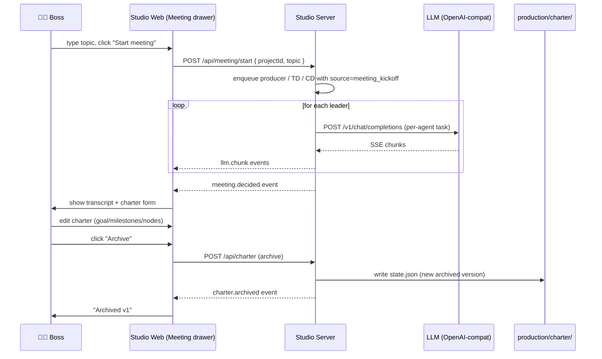
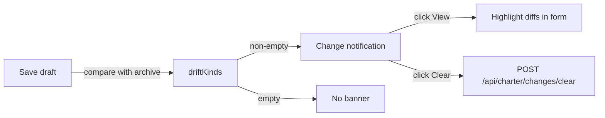

# 06 · Meeting Room & Project Charter

The Meeting Room is the most distinctive UX in AiGameAgent. It's where the boss meets the leadership subset (producer / technical-director / creative-director), debates a topic, edits a charter, and archives a version. The charter becomes the spec that downstream work follows.

**Source:** `apps/studio-web/src/main.ts` (`setupMeetingUI`) + `apps/studio-server/src/index.ts` (charter state, meeting API, leadership enqueue)

## Why a meeting room?

Most AI dev tools start with "type a prompt". AiGameAgent starts with **"what are we building?"** The meeting room is the *first* thing the boss uses, before any code is written.

The leadership subset (3 agents) are the only ones that talk in a meeting. They each have a role:

| Speaker | Asks | Looks for |
|---------|------|-----------|
| Producer | "What is the *one* thing we are shipping? In one sentence." | Goal clarity, scope, milestones |
| Technical Director | "What model, what compute, what's the risk?" | Provider choice, parallel work, latency |
| Creative Director | "What's the player fantasy? What does 'done' look like?" | Acceptance criteria, preview gate |

The boss arbitrates: writes the charter, archives it, then the producer's chain kicks off the rest.

## Meeting flow



## Charter data model

```ts
type CharterBody = { goal: string; milestones: string[]; nodes: string[] };
type CharterArchived = CharterBody & { version: number; archivedAt: string };
type PerProjectCharter = { draft: CharterBody; archived: CharterArchived | null; history: CharterArchived[] };
type CharterRootState = { projects: Record<string, PerProjectCharter>; pendingChanges: Record<string, PendingChange> };
type PendingChange = { kinds: string[]; count: number; updatedAt: string; lastNotifyTs?: string };
```

- **draft** is what the boss is currently editing
- **archived** is the latest "frozen" version (or `null` if never archived)
- **history** is a stack of all archived versions
- **pendingChanges** records drift kinds for the UI

State is persisted to `production/charter/state.json` (gitignored).

## REST surface for meeting & charter

| Method | Path | Purpose |
|--------|------|---------|
| `POST` | `/api/meeting/start` | Kick off a leadership meeting (with optional `topic`) |
| `GET` | `/api/meeting/llm_ping` | Test that the meeting provider is reachable |
| `GET` | `/api/charter?projectId=X` | Read draft + archived + history for project X |
| `POST` | `/api/charter` | Save draft (action: `save_draft`) or archive (action: `archive`) |
| `GET` | `/api/charter/changes?projectId=X` | Read pending changes (drift kinds) |
| `POST` | `/api/charter/changes/clear` | Clear pending changes for a project |

## Parsing the leadership transcript

LLM outputs are noisy. The server has three parsers, tried in order:

```ts
function parseMeetingTranscriptAny(rawAssistant: string) {
  return parseMeetingTranscriptJson(raw) ?? parseMeetingTranscriptLoose(raw);
}
```

1. **JSON** — strict `JSON.parse` of `{ lines: [{ speaker, text }] }`
2. **Fenced JSON** — strip ```` ```json ... ``` ```` fences, then JSON.parse
3. **Outer slice** — `sliceOutermostJsonObject()` to grab the first `{...}` from prose

If JSON parsing fails entirely, the loose parser kicks in:

```ts
const allowed = /^(Secretary|Producer|Technical Director|Creative Director)\s*[:：]\s*(.+)$/;
```

This matches Chinese speakers followed by a colon (full-width `：` or half-width `:`), one per line. Three or more matched lines → transcript. Designed for small local models that ignore JSON output format.

## The "auto kickoff" checkbox

In the meeting tab, there's a `meetingAutoKickoff` checkbox. When checked, after `charter.archived` fires, the server automatically enqueues the producer chain:

```ts
if (meetingAutoKickoff && ev.type === "charter.archived") {
  // Enqueue producer → designer → programmer → artist → QA
}
```

This is what the secretary HUD reports as "after the kickoff first cut completes, design/programming/art/QA follow-up tasks are auto-enqueued".

## Charter drift UI



The drift kinds:

- `goal_changed` — `draft.goal.trim() !== archived.goal.trim()`
- `milestones_changed` — JSON.stringify of normalised milestone array differs
- `nodes_changed` — JSON.stringify of normalised nodes array differs
- `first_archive` — never had an archive but the draft has content

The UI shows: `Pending drift: goal_changed, milestones_changed (total 3)`. The `count` is the number of times drift has been recorded for the current draft (so the boss knows the draft has been "wobbling").

## Skip-LLM meetings (the "rules" mode)

Sometimes the boss doesn't want a 3-LLM round. The meeting drawer has a `meetingSkipLlm` checkbox; when on, the meeting transcript is **pre-canned rules-based content** and no LLM call is made.

The two modes map to the `producer.mode` and `creativeDirector.mode` policy fields:

- `mode: "rules"` → meeting drawer uses canned prompts
- `mode: "llm"` → meeting drawer calls the meeting provider (default: `cloud`)

Default policy is `"rules"` for all three tiers — change to `"llm"` to enable the LLM-driven path.

## Project switching inside the meeting drawer

The drawer has a `meetingProject` select. Switching it triggers:

1. `setCurrentProjectGlobal(pid)` (writes to `window.__STUDIO_CURRENT_PROJECT__`)
2. `refreshCharter()` — re-fetches `/api/charter?projectId=...`
3. `refreshCharterChanges()` — re-fetches `/api/charter/changes?projectId=...`

This means the same UI can be used to manage multiple projects (e.g. "Snake MVP" + "Card Game Spinoff" in parallel).

## Edge cases the spec calls out

From `studio-meeting-room/spec.md`:

> **Scenario: Repeatedly clicking the Start button**
> - **WHEN** the boss clicks "Start meeting" again while a meeting is still in progress
> - **THEN** the system SHALL ignore the second click (to avoid generating duplicate transcripts)

> **Scenario: LLM parse failure**
> - **WHEN** none of the three directors' LLM outputs can be parsed by any parser
> - **THEN** the system SHALL show an error and leave the transcript area empty (rather than crash)

> **Scenario: Kickoff meeting with no LLM**
> - **WHEN** "Skip LLM" is checked and Start is clicked
> - **THEN** the system SHALL fill the transcript with built-in templates and let the boss edit the charter directly

## Next

- [OpenSpec Change Control](/docs/05-openspec) — the wider spec system the charter lives in
- [Monitor & HTML Preview](/docs/07-monitor-and-preview) — what gets saved when the producer chain finishes
- [Finance & Model Routing](/docs/09-finance-and-routing) — how meeting provider is chosen
