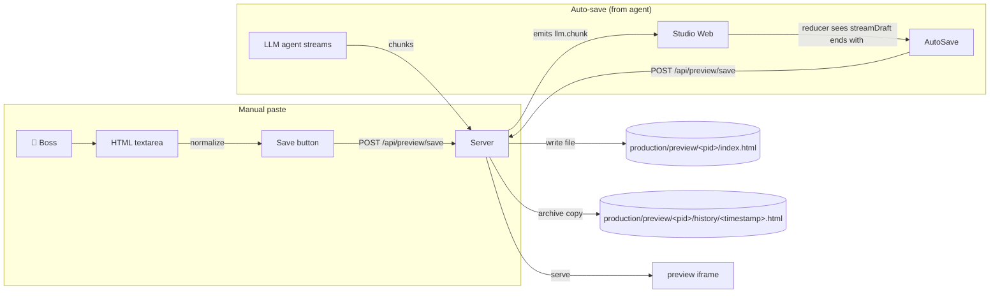

# 07 · Monitor & HTML Preview

The Monitor is the boss's window into the current project's deliverable. It's an iframe that points at a server-served HTML file, with a sidecar for history, restore, and a textarea for manual paste.

**Source:** `apps/studio-web/src/main.ts` (`setupMonitorUI`) · `apps/studio-server/src/index.ts` (preview routes)

## Two flows into the preview



## File layout

```
production/preview/
└── <projectId>/
    ├── index.html            # current preview (served by /preview)
    ├── history/
    │   ├── 2026-06-12T03-21-44.html
    │   ├── 2026-06-12T03-25-11.html
    │   └── ...
    └── assets/
        └── gen/
            └── run_<hex>/    # from studioGenerateImages
                ├── 0.png
                ├── 1.png
                └── ...
```

`projectId` is sanitised to `[a-zA-Z0-9_-]` before any path join — directory traversal is structurally impossible.

## HTML normalisation (the "boss pasted a markdown fence" problem)

LLMs (and humans pasting from chat) often wrap HTML in markdown fences or pre-amble it with prose. The `normalizePreviewHtmlInput()` function on the client tries three forms:

```ts
function normalizePreviewHtmlInput(raw: string): { html: string; hint?: string } {
  // 1. Strip ```html ... ``` fences
  const fence = trimmed.match(/^```(?:html)?\s*([\s\S]*?)\s*```$/i);
  if (fence?.[1]) return { html: fence[1].trim(), hint: "已自动去掉 ``` 代码块包裹" };

  // 2. If there's a <!doctype html> or <html> mid-string, slice from there
  const docStart = trimmed.search(/<!doctype\s+html|<html[\s>]/i);
  if (docStart > 0) {
    return { html: trimmed.slice(docStart).trim(), hint: "已从文本中提取 <html> 文档片段" };
  }

  // 3. Use as-is
  return { html: trimmed };
}
```

If a hint was applied, the secretary HUD logs it. This is the difference between "save worked" and "boss pastes a 5-page chat reply and wonders why the preview is blank".

## Server routes

| Method | Path | Purpose |
|--------|------|---------|
| `GET` | `/preview?projectId=X[&v=file.html]` | Serve `index.html` (default) or a specific history file |
| `POST` | `/api/preview/save` | Save HTML for a project (with auto-history) |
| `GET` | `/api/preview/history?projectId=X` | List history files (newest first) |
| `POST` | `/api/preview/restore` | Copy a history file back to `index.html` |

The save endpoint enforces a 20-character minimum:

```ts
if (html.length < 20) return { ok: false, error: "html_too_short" };
```

This catches empty / whitespace-only pastes.

## Auto-save detection (the magic)

After every `llm.message_done`, the client checks: does the agent's `summary` (the completed message) contain a full HTML document?

```ts
function extractHtmlDocFromText(raw: string): string | null {
  const n = normalizePreviewHtmlInput(raw).html;
  if (!n) return null;
  const hasStart = /<!doctype\s+html/i.test(n) || /<html[\s>]/i.test(n);
  const hasEnd = /<\/html>/i.test(n);
  if (!hasStart || !hasEnd) return null;
  if (n.length < 200) return null;
  return n;
}

// In the reducer's onMessageDone handler:
const htmlDoc = aid ? extractHtmlDocFromText(this.state.agents[aid]?.summary ?? "") : null;
if (htmlDoc) {
  fetch(`${this.studio.http}/api/preview/save`, {
    method: "POST",
    headers: { "content-type": "application/json" },
    body: JSON.stringify({ html: htmlDoc, projectId: pid })
  });
  setSecretaryHud(`已自动保存 HTML。预览 ${url}`);
}
```

The 200-character minimum is a pragmatic floor: a `200` `<!doctype html></html>` is the smallest meaningful page.

## Project switching in the monitor

The monitor has its own `monitorProject` select. Switching it:

1. Calls `POST /api/projects/select` to mark it current
2. Updates the iframe `src` to `/preview?projectId=X`
3. Reloads the history list
4. Sets `window.__STUDIO_CURRENT_PROJECT__` so other panels pick it up

The auto-save event listener (`studio-preview-saved`) also re-syncs the project select if a save arrived for a project the boss wasn't viewing.

## History & restore

Each save **also** writes a timestamped copy:

```ts
const ts = new Date().toISOString().replace(/[:.]/g, "-");
const histFile = join(previewDir, pid, "history", `${ts}.html`);
await writeFile(histFile, html, "utf8");
```

The history list shows newest-first. Clicking a filename loads it in the iframe (without overwriting `index.html`). Clicking "Restore as current" copies the file back to `index.html` — useful when the latest agent output regressed.

## Failure surfacing

If `studio-failures-refresh` fires (after a `job.failed` or `job.finished` with `ok: false`), the monitor re-fetches `/api/studio/failures?limit=25` and shows the last 25 failures in a side panel — each with a "Copy ID" button to grab the `correlationId` for debugging.

The failure list shape:

```ts
{
  ts: string;
  type: "job.failed" | "job.finished";
  correlationId: string;
  agentId?: string;
  payload: { message?: string; error?: string; failureReason?: string };
}
```

## Why an iframe and not innerHTML?

1. **CSP safety** — the saved HTML could include `<script>`, `eval`, `fetch` to a third-party origin. An iframe is naturally sandboxed (same-origin) and CSP can be added per response.
2. **Reset semantics** — to "reload" a preview, you just bump `iframe.src` (or change the `&v=` query string). With `innerHTML` you'd have to strip the previous DOM and worry about leaked event listeners.
3. **No leak of agent context into the parent app** — agent output stays in the iframe's world; the host page is unaffected by an agent's `setTimeout(alert, 1000)`.

The trade-off: same-origin iframes inherit the parent's cookies / localStorage. The mitigation is to **not** load the preview with credentials and to keep the served HTML trustworthy (it's the boss's own output, not a third-party's).

## Next

- [Asset Pipeline](/docs/08-asset-pipeline) — how images / sprite sheets / videos get stored alongside the preview
- [Finance & Model Routing](/docs/09-finance-and-routing) — what the auto-save cost looks like
- [Open API Reference](/docs/13-api-reference) — the full preview API
